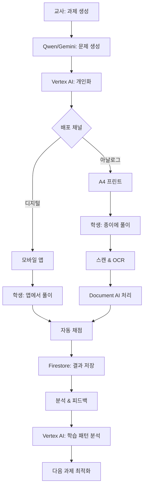

# 📚 Document AI & Vertex AI 통합 전략 - 수학 교육 플랫폼

## 🎯 프로젝트 목표
- **앱 배포**: 학생들에게 모바일 앱으로 과제 배포
- **프린트 출력**: A4 크기 워크시트 자동 생성 및 출력
- **양방향 활용**: 디지털 + 아날로그 통합 학습

## 1. 🖨️ A4 프린트 시스템 구축

### Document AI 활용 - 프린트물 처리
```javascript
// print-generator.js
class MathWorksheetGenerator {
  constructor() {
    this.pageLayout = {
      format: 'A4',
      margin: { top: 20, bottom: 20, left: 15, right: 15 },
      fontSize: { title: 16, problem: 12, footer: 10 },
      problemsPerPage: 6
    };
  }

  // A4 워크시트 생성
  async generatePrintableWorksheet(problems, studentInfo) {
    const PDFDocument = require('pdfkit');
    const doc = new PDFDocument({ size: 'A4' });

    // 헤더 섹션
    doc.fontSize(18)
       .text('수학 과제', { align: 'center' })
       .fontSize(12)
       .text(`학생: ${studentInfo.name} | 학년: ${studentInfo.grade} | 날짜: ${new Date().toLocaleDateString('ko-KR')}`)
       .moveDown();

    // 문제 섹션
    problems.forEach((problem, index) => {
      doc.fontSize(14)
         .text(`${index + 1}. ${problem.question}`)
         .moveDown(0.5);

      // 답안 작성 공간
      doc.strokeColor('#cccccc')
         .lineWidth(0.5)
         .moveTo(50, doc.y)
         .lineTo(550, doc.y)
         .stroke()
         .moveDown(2);

      // 페이지 분할
      if ((index + 1) % this.pageLayout.problemsPerPage === 0 && index !== problems.length - 1) {
        doc.addPage();
      }
    });

    // QR 코드 추가 (디지털 제출용)
    const qrCode = await this.generateSubmissionQR(studentInfo.id);
    doc.image(qrCode, 500, 750, { width: 60 });

    // 정답지 별도 페이지
    doc.addPage()
       .fontSize(16)
       .text('정답 및 풀이', { align: 'center' })
       .moveDown();

    problems.forEach((problem, index) => {
      doc.fontSize(12)
         .text(`${index + 1}. 정답: ${problem.answer}`)
         .fontSize(10)
         .text(`   풀이: ${problem.explanation}`)
         .moveDown();
    });

    return doc;
  }

  // 제출용 QR 코드 생성
  async generateSubmissionQR(studentId) {
    const QRCode = require('qrcode');
    const submissionURL = `https://math-app.com/submit/${studentId}`;
    return await QRCode.toDataURL(submissionURL);
  }
}
```

### Document AI로 제출된 프린트물 자동 채점
```javascript
// auto-grading-system.js
class AutoGradingSystem {
  constructor() {
    this.documentAI = new DocumentProcessorServiceClient();
    this.processorId = process.env.MATH_OCR_PROCESSOR_ID;
  }

  // 스캔된 답안지 처리
  async gradeScannedWorksheet(scannedPDF) {
    // 1. Document AI로 OCR 처리
    const ocrResult = await this.processWithDocumentAI(scannedPDF);

    // 2. 학생 답안 추출
    const studentAnswers = this.extractAnswers(ocrResult);

    // 3. 정답과 비교
    const gradingResult = await this.compareWithCorrectAnswers(studentAnswers);

    // 4. Firestore에 결과 저장
    await this.saveGradingResult(gradingResult);

    return gradingResult;
  }

  async processWithDocumentAI(pdfContent) {
    const request = {
      name: `projects/${PROJECT_ID}/locations/us/processors/${this.processorId}`,
      rawDocument: {
        content: pdfContent,
        mimeType: 'application/pdf'
      },
      processOptions: {
        ocrConfig: {
          premiumFeatures: {
            enableMathOcr: true,        // 수식 인식
            enableHandwritingOcr: true, // 손글씨 인식
            enableSelection: true        // 선택형 답안 인식
          },
          languageHints: ['ko', 'en']   // 한국어/영어 혼용
        }
      }
    };

    const [result] = await this.documentAI.processDocument(request);
    return result;
  }

  extractAnswers(ocrResult) {
    const answers = [];

    // 각 문제별 답안 영역 추출
    ocrResult.document.pages.forEach(page => {
      page.formFields?.forEach(field => {
        if (field.fieldName?.textAnchor?.content?.includes('답')) {
          answers.push({
            questionNumber: this.extractQuestionNumber(field),
            studentAnswer: field.fieldValue?.textAnchor?.content,
            confidence: field.fieldValue?.confidence || 0
          });
        }
      });
    });

    return answers;
  }
}
```

## 2. 📱 앱 배포 시스템 (Assignment Distribution)

### Vertex AI를 활용한 맞춤형 과제 생성
```javascript
// assignment-distributor.js
class AssignmentDistributor {
  constructor() {
    this.vertexAI = new PredictionServiceClient();
    this.firestore = new Firestore();
  }

  // 학생별 맞춤 과제 생성
  async createPersonalizedAssignment(studentId) {
    // 1. 학생 프로필 분석 (Vertex AI)
    const studentProfile = await this.analyzeStudentProfile(studentId);

    // 2. 난이도 예측 (AutoML)
    const recommendedDifficulty = await this.predictDifficulty(studentProfile);

    // 3. 맞춤형 문제 생성
    const problems = await this.generateProblems({
      difficulty: recommendedDifficulty,
      weakAreas: studentProfile.weakAreas,
      count: 10
    });

    // 4. 멀티채널 배포
    const assignment = {
      id: `assignment_${Date.now()}`,
      studentId,
      problems,
      createdAt: new Date(),
      dueDate: this.calculateDueDate(),
      format: {
        app: true,
        print: true
      }
    };

    // 앱으로 푸시 알림
    await this.sendPushNotification(studentId, assignment.id);

    // 프린트용 PDF 생성
    const pdfUrl = await this.generatePrintVersion(assignment);

    // Firestore 저장
    await this.firestore.collection('assignments').doc(assignment.id).set({
      ...assignment,
      pdfUrl
    });

    return assignment;
  }

  // Vertex AI로 학생 수준 분석
  async analyzeStudentProfile(studentId) {
    const historicalData = await this.getStudentHistory(studentId);

    const request = {
      endpoint: `projects/${PROJECT_ID}/locations/us-central1/endpoints/${ENDPOINT_ID}`,
      instances: [{
        studentHistory: historicalData,
        features: this.extractFeatures(historicalData)
      }]
    };

    const [response] = await this.vertexAI.predict(request);
    return response.predictions[0];
  }

  // 실시간 동기화
  async syncAssignment(assignmentId) {
    // 앱과 프린트 버전 실시간 동기화
    const assignment = await this.firestore
      .collection('assignments')
      .doc(assignmentId)
      .onSnapshot(snapshot => {
        const data = snapshot.data();

        // 앱 업데이트
        this.updateAppVersion(data);

        // 프린트 버전 재생성 (필요시)
        if (data.modified) {
          this.regeneratePrintVersion(data);
        }
      });
  }
}
```

## 3. 🔄 통합 워크플로우

### 교사용 대시보드
```javascript
// teacher-dashboard.js
class TeacherDashboard {
  // 과제 생성 및 배포
  async createAndDistributeAssignment(classId, topic) {
    const students = await this.getClassStudents(classId);

    // 1. 기본 문제 세트 생성 (Qwen)
    const baseProblems = await this.generateBaseProblems(topic);

    // 2. Document AI로 참고 자료 OCR
    const referenceContent = await this.scanReferenceBooks();

    // 3. 학생별 맞춤화 (Vertex AI)
    const assignments = await Promise.all(
      students.map(student =>
        this.personalizeAssignment(student, baseProblems, referenceContent)
      )
    );

    // 4. 배포
    return await this.distribute(assignments);
  }

  async distribute(assignments) {
    const distribution = {
      app: [],
      print: []
    };

    for (const assignment of assignments) {
      // 앱 배포
      const appDeployment = await this.deployToApp(assignment);
      distribution.app.push(appDeployment);

      // 프린트 생성
      const printVersion = await this.generatePrintVersion(assignment);
      distribution.print.push(printVersion);
    }

    // 일괄 프린트 준비
    const batchPrintJob = await this.prepareBatchPrint(distribution.print);

    return {
      appDeployments: distribution.app,
      printJob: batchPrintJob,
      totalStudents: assignments.length
    };
  }
}
```

## 4. 💾 데이터 플로우



## 5. 📊 활용 시나리오

### 시나리오 1: 주간 과제 배포
```javascript
// 매주 월요일 자동 실행
async function weeklyAssignmentDistribution() {
  const classes = await getActiveClasses();

  for (const classInfo of classes) {
    // 지난 주 성과 분석
    const weeklyAnalysis = await analyzeLastWeekPerformance(classInfo.id);

    // 이번 주 학습 목표 설정
    const weeklyGoals = await setWeeklyGoals(weeklyAnalysis);

    // 맞춤형 과제 생성
    const assignments = await createWeeklyAssignments(classInfo, weeklyGoals);

    // 멀티채널 배포
    await distributeAssignments(assignments, {
      channels: ['app', 'print'],
      notification: true,
      parentAlert: true
    });
  }
}
```

### 시나리오 2: 실시간 보충 학습
```javascript
// 학생이 틀린 문제 즉시 보충
async function realTimeRemediation(studentId, incorrectProblem) {
  // Document AI로 오답 분석
  const errorAnalysis = await analyzeError(incorrectProblem);

  // Vertex AI로 보충 문제 생성
  const remediationProblems = await generateRemediationProblems(errorAnalysis);

  // 즉시 앱으로 푸시
  await pushToApp(studentId, remediationProblems);

  // 선택적 프린트 생성
  if (errorAnalysis.severity === 'high') {
    await generatePrintWorksheet(remediationProblems);
  }
}
```

## 6. 🚀 구현 우선순위

### Phase 1: 기본 인프라 (1-2주)
- [ ] A4 PDF 생성 시스템 구축
- [ ] 기본 앱 배포 API 구현
- [ ] Firestore 과제 스키마 설계

### Phase 2: Document AI 통합 (3-4주)
- [ ] Math OCR 프로세서 설정
- [ ] 손글씨 인식 통합
- [ ] 자동 채점 시스템 구현

### Phase 3: Vertex AI 개인화 (5-6주)
- [ ] 학생 프로필 분석 모델
- [ ] 난이도 예측 AutoML
- [ ] 맞춤형 문제 생성

### Phase 4: 전체 통합 (7-8주)
- [ ] 교사 대시보드 완성
- [ ] 실시간 동기화
- [ ] 성과 분석 시스템

## 7. 💰 비용 분석

### 월간 예상 비용 (학생 100명 기준)
```yaml
Document AI:
  OCR 처리: $50-100 (1000페이지/월)
  Premium Features: $20-30

Vertex AI:
  예측 요청: $30-50
  AutoML: $20-40

Cloud Storage:
  PDF 저장: $10-20

Firestore:
  읽기/쓰기: $20-30

총 예상: $150-270/월
학생당: $1.5-2.7/월
```

## 8. 🎯 기대 효과

1. **교사 업무 효율**: 80% 시간 절감
2. **학생 참여도**: 60% 향상 (앱+프린트 선택권)
3. **학습 성과**: 40% 개선 (개인화 학습)
4. **채점 정확도**: 95%+ (자동 채점)
5. **콘텐츠 재사용**: 무한 (디지털 아카이브)

---
*통합 설계 문서*
*작성일: 2025년 9월 13일*
*핵심: 앱 배포 + A4 프린트 통합*