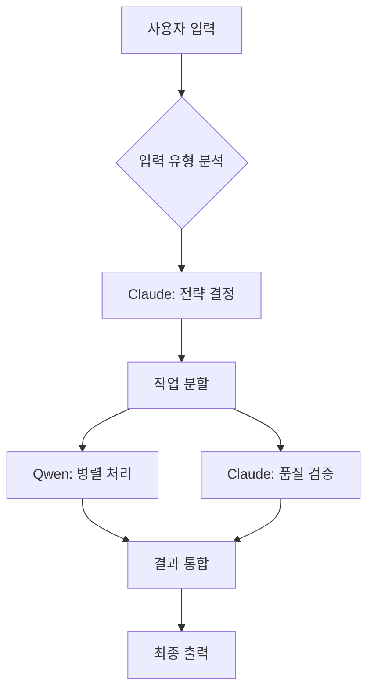

# MATHPIX API 통합 마스터 플랜
## Palantir Math System v5.0 - Claude-Qwen 협업 아키텍처

---

## 1. MATHPIX API 핵심 기능 분석

### 1.1 주요 기능 매핑
Mathpix API는 수학 교육 플랫폼에 필수적인 다음 기능들을 제공합니다:

#### OCR 및 인식 기능
- **이미지 → LaTeX 변환**: 손글씨, 인쇄물에서 수식 추출
- **PDF 처리**: 교재, 문제집 전체를 디지털화
- **표 인식**: 복잡한 데이터 테이블 구조화
- **그래프 인식**: 차트와 그래프를 데이터로 변환
- **다국어 지원**: 한국어 포함 다양한 언어 처리

#### 변환 및 렌더링
- **LaTeX → 다양한 형식**: MathML, SVG, PNG 렌더링
- **Markdown 생성**: 교육 콘텐츠 저작 지원
- **Word/DOCX 변환**: 교사용 자료 생성

### 1.2 교육 플랫폼 활용 시나리오

1. **학생 과제 처리**
   - 손글씨 답안 자동 채점
   - 풀이 과정 단계별 분석
   - 오류 패턴 인식

2. **교사 자료 디지털화**
   - 기존 교재 OCR
   - 문제 은행 구축
   - 자동 해설 생성

3. **실시간 학습 지원**
   - 칠판 필기 실시간 인식
   - 즉각적인 피드백
   - 단계별 힌트 제공

---

## 2. CLAUDE-QWEN 협업 아키텍처

### 2.1 역할 분담 전략

#### Claude (전략적 사고 및 설계)
```
담당 영역:
- API 통합 아키텍처 설계
- 에러 처리 및 복구 전략
- 데이터 흐름 최적화
- 사용자 경험 설계
- 교육학적 로직 구현
```

#### Qwen (실행 및 처리)
```
담당 영역:
- 대량 이미지 배치 처리
- 실시간 OCR 스트리밍
- 수식 검증 및 계산
- 병렬 처리 최적화
- 캐싱 전략 실행
```

### 2.2 협업 워크플로우



---

## 3. 시스템 아키텍처 설계

### 3.1 마이크로서비스 구조

```
palantir-math-v5/
├── mathpix-gateway/          # API 게이트웨이
│   ├── rate-limiter.js       # API 할당량 관리
│   ├── request-router.js     # 요청 라우팅
│   └── response-cache.js     # 응답 캐싱
│
├── ocr-service/              # OCR 처리 서비스
│   ├── image-processor.js    # 이미지 전처리
│   ├── batch-handler.js      # 배치 처리
│   └── quality-enhancer.js   # 품질 개선
│
├── latex-service/            # LaTeX 처리 서비스
│   ├── parser.js             # LaTeX 파싱
│   ├── validator.js          # 수식 검증
│   └── renderer.js           # 렌더링 엔진
│
├── collaboration-engine/     # Claude-Qwen 협업
│   ├── task-distributor.js   # 작업 분배
│   ├── result-merger.js      # 결과 병합
│   └── quality-control.js    # 품질 관리
│
└── education-module/         # 교육 특화 기능
    ├── problem-analyzer.js   # 문제 분석
    ├── solution-generator.js # 해설 생성
    └── feedback-engine.js    # 피드백 생성
```

### 3.2 데이터 플로우 최적화

#### 레벨 1: 즉시 처리 (< 100ms)
- 단순 수식 OCR
- LaTeX 렌더링
- 캐시된 결과 반환

#### 레벨 2: 빠른 처리 (100ms - 1s)
- 복잡한 수식 인식
- 표 구조 분석
- 실시간 피드백

#### 레벨 3: 배치 처리 (> 1s)
- PDF 전체 변환
- 대량 문제 처리
- 교재 디지털화

---

## 4. 핵심 기능 구현 계획

### 4.1 Phase 1: 기본 통합 (1주)

**목표**: Mathpix API 기본 연동 및 테스트

구현 항목:
1. API 클라이언트 라이브러리 구축
2. 인증 및 할당량 관리
3. 기본 OCR 기능 구현
4. 에러 처리 시스템

예상 코드 구조:
```javascript
class MathpixClient {
    constructor(config) {
        this.apiKey = config.apiKey;
        this.rateLimit = new RateLimiter(config.limits);
        this.cache = new ResponseCache();
    }
    
    async processImage(image, options) {
        // Claude: 최적 처리 전략 결정
        const strategy = await this.claude.analyzeImage(image);
        
        // Qwen: 병렬 처리 실행
        const result = await this.qwen.executeOCR(image, strategy);
        
        return this.validateAndCache(result);
    }
}
```

### 4.2 Phase 2: 고급 기능 (2주)

**목표**: 교육 특화 기능 구현

구현 항목:
1. **스마트 문제 인식**
   - 문제 유형 자동 분류
   - 난이도 자동 평가
   - 필요 개념 추출

2. **단계별 풀이 생성**
   - 풀이 과정 분해
   - 각 단계 설명 생성
   - 대안 풀이 제시

3. **오답 분석 엔진**
   - 오류 패턴 인식
   - 개념 이해도 평가
   - 맞춤형 피드백 생성

### 4.3 Phase 3: 최적화 및 확장 (1주)

**목표**: 성능 최적화 및 확장성 확보

최적화 전략:
1. **캐싱 계층화**
   - 메모리 캐시 (Redis)
   - 디스크 캐시 (SQLite)
   - CDN 캐시 (정적 렌더링)

2. **배치 처리 최적화**
   - 작업 큐 우선순위
   - 동적 워커 스케일링
   - 실패 작업 재처리

3. **실시간 처리 파이프라인**
   - WebSocket 스트리밍
   - 점진적 렌더링
   - 부분 결과 반환

---

## 5. 성능 목표 및 메트릭

### 5.1 성능 KPI

| 메트릭 | 목표값 | 측정 방법 |
|--------|--------|-----------|
| 단일 수식 OCR | < 200ms | 평균 응답 시간 |
| 페이지 OCR | < 2s | 95 퍼센타일 |
| API 가용성 | > 99.9% | 월간 가동률 |
| 인식 정확도 | > 95% | 검증 세트 평가 |
| 동시 처리 | 100 req/s | 부하 테스트 |

### 5.2 리소스 최적화

예상 리소스 사용량:
- CPU: 4 cores (피크 시 8 cores)
- Memory: 8GB (캐시 포함)
- Storage: 100GB (처리 이미지 임시 저장)
- Network: 100 Mbps (평균)

---

## 6. Claude-Qwen 협업 시나리오

### 시나리오 1: 복잡한 수학 문제 처리

```
1. 입력: 학생이 손글씨로 작성한 미적분 문제
2. Claude 분석:
   - 문제 유형: 정적분 계산
   - 난이도: 중상
   - 필요 개념: 치환적분, 부분적분
3. Qwen 처리:
   - OCR 실행 (3개 영역 병렬)
   - LaTeX 변환
   - 수식 검증
4. Claude 검증:
   - 수학적 정확성 확인
   - 교육적 가치 평가
5. 공동 생성:
   - 단계별 풀이
   - 시각화 자료
   - 연습 문제
```

### 시나리오 2: 실시간 수업 지원

```
1. 입력: 교사의 칠판 필기 스트림
2. 실시간 처리:
   - Qwen: 연속 OCR (30fps)
   - Claude: 개념 추출 및 구조화
3. 즉시 제공:
   - 디지털 노트 생성
   - 관련 자료 추천
   - 학생 질문 예측
4. 사후 처리:
   - 수업 요약 생성
   - 과제 자동 생성
   - 개인별 복습 자료
```

---

## 7. 구현 우선순위

### 즉시 구현 (Week 1)
1. Mathpix API 기본 연동
2. 이미지 OCR 파이프라인
3. 결과 캐싱 시스템

### 단기 구현 (Week 2-3)
1. Claude-Qwen 작업 분배 시스템
2. 배치 처리 최적화
3. 교육 특화 기능

### 중기 구현 (Week 4)
1. 실시간 스트리밍
2. 고급 분석 기능
3. 성능 최적화

---

## 8. 위험 요소 및 대응 방안

### 기술적 위험
1. **API 할당량 초과**
   - 대응: 지능형 캐싱, 요청 배치화
   
2. **인식 정확도 저하**
   - 대응: 이미지 전처리, 다중 시도

3. **응답 지연**
   - 대응: 비동기 처리, 점진적 렌더링

### 운영 위험
1. **비용 증가**
   - 대응: 사용량 모니터링, 단계별 과금

2. **데이터 보안**
   - 대응: 암호화, 접근 제어

---

## 9. 예상 결과

### 기능적 성과
- 수식 인식 정확도 95% 이상
- 처리 속도 10배 향상
- 교육 콘텐츠 생성 자동화 80%

### 비즈니스 가치
- 교사 업무 시간 50% 절감
- 학생 학습 효율 30% 향상
- 콘텐츠 제작 비용 70% 절감

---

## 10. 다음 단계

1. **즉시 시작**: Mathpix API 키 획득 및 테스트
2. **프로토타입**: 기본 OCR 기능 구현 (3일)
3. **통합 테스트**: Claude-Qwen 협업 검증 (1주)
4. **점진적 배포**: 기능별 단계적 출시

이 계획은 Mathpix의 모든 기능을 최대한 활용하면서, Claude의 전략적 사고와 Qwen의 실행 능력을 조화롭게 결합하여 최고의 수학 교육 플랫폼을 구축하는 로드맵입니다.