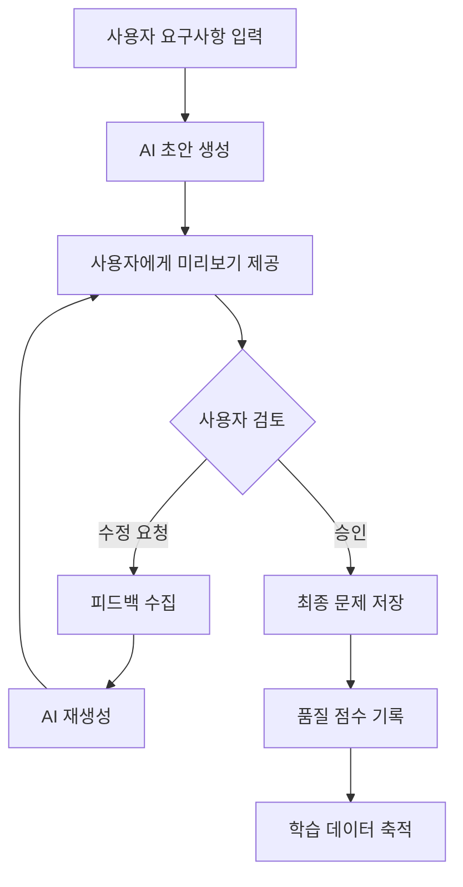
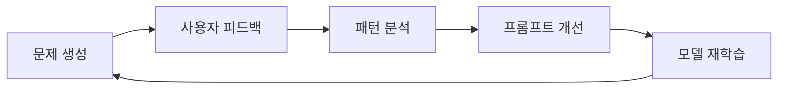

# 🎓 수학 문제 생성 시스템 V2 - 사용자 중심 설계

## 💰 수정된 비용 최적화 전략

### 현재 비용 구조 (월간)
```yaml
실제 비용:
  Qwen3-Max-Preview: $0 (무료 티어)
  Gemini-1.5-Flash: $5-10 (백업용)
  Claude Opus 4.1: $0 (구독 무제한)
  Firestore: $10-15
  Cloud Functions: $5-10

총 월간 비용: $20-35 (기존 예상 대비 70% 절감)
```

### 무료 리소스 최대 활용
```javascript
// 비용 효율적인 AI 선택 로직
class CostOptimizedOrchestrator {
  async selectModel(requirements) {
    // 1순위: Qwen (무료)
    if (requirements.language === 'ko' || requirements.type === 'standard') {
      return {
        model: 'qwen3-max-preview',
        cost: 0,
        reason: '무료 티어 활용'
      };
    }

    // 2순위: Claude (구독 무제한)
    if (requirements.complexity === 'high' || requirements.validation) {
      return {
        model: 'claude-opus-4.1',
        cost: 0,
        reason: '구독 활용'
      };
    }

    // 3순위: Gemini (유료, 최소 사용)
    return {
      model: 'gemini-1.5-flash',
      cost: 0.0001,
      reason: '특수 케이스만'
    };
  }
}
```

## 🔄 사용자 승인 워크플로우

### 상호작용 기반 문제 생성 프로세스


### 구현 코드
```javascript
// interactive-math-generator.js

class InteractiveMathGenerator {
  constructor(userId) {
    this.userId = userId;
    this.session = {
      id: `session_${Date.now()}`,
      iterations: [],
      feedback: [],
      finalVersion: null
    };
  }

  // 1단계: 초기 생성
  async generateDraft(requirements) {
    console.log(`\n🎯 문제 생성 요구사항:`);
    console.log(`- 학년: ${requirements.grade}`);
    console.log(`- 주제: ${requirements.topic}`);
    console.log(`- 난이도: ${requirements.difficulty}`);
    console.log(`- 개수: ${requirements.count}`);

    // Qwen으로 초안 생성 (무료)
    const draft = await this.qwen.generate({
      ...requirements,
      prompt: this.buildDetailedPrompt(requirements)
    });

    this.session.iterations.push({
      version: 1,
      problems: draft,
      timestamp: new Date()
    });

    return this.presentForApproval(draft);
  }

  // 2단계: 사용자에게 제시
  presentForApproval(problems) {
    console.log('\n📝 생성된 문제 초안:\n');

    problems.forEach((problem, index) => {
      console.log(`[문제 ${index + 1}]`);
      console.log(`Q: ${problem.question}`);
      console.log(`A: ${problem.answer}`);
      console.log(`설명: ${problem.explanation}`);
      console.log(`난이도: ${problem.difficulty}\n`);
    });

    return {
      problems,
      actions: [
        '✅ 승인 - 현재 버전 사용',
        '🔄 수정 - 특정 부분 개선',
        '❌ 재생성 - 전체 다시 생성',
        '💬 피드백 - 구체적 요구사항 추가'
      ],
      sessionId: this.session.id
    };
  }

  // 3단계: 피드백 처리
  async processFeedback(action, feedback) {
    this.session.feedback.push({
      action,
      feedback,
      timestamp: new Date()
    });

    switch(action) {
      case 'approve':
        return await this.finalize();

      case 'modify':
        return await this.modifyProblems(feedback);

      case 'regenerate':
        return await this.regenerateAll(feedback);

      case 'feedback':
        return await this.incorporateFeedback(feedback);
    }
  }

  // 4단계: 수정 및 개선
  async modifyProblems(feedback) {
    console.log('\n🔧 문제 수정 중...');
    console.log(`피드백: ${feedback}`);

    // 이전 버전 + 피드백으로 개선
    const previousVersion = this.session.iterations[this.session.iterations.length - 1];

    const improvedPrompt = {
      previousProblems: previousVersion.problems,
      userFeedback: feedback,
      instruction: '사용자 피드백을 반영하여 문제를 개선해주세요.'
    };

    const improved = await this.qwen.improve(improvedPrompt);

    this.session.iterations.push({
      version: this.session.iterations.length + 1,
      problems: improved,
      feedback: feedback,
      timestamp: new Date()
    });

    return this.presentForApproval(improved);
  }

  // 5단계: 최종 승인 및 저장
  async finalize() {
    const finalVersion = this.session.iterations[this.session.iterations.length - 1];

    // 품질 점수 계산
    const qualityScore = this.calculateQualityScore();

    // Firestore 저장
    await firestore.collection('approved_problems').add({
      userId: this.userId,
      sessionId: this.session.id,
      problems: finalVersion.problems,
      metadata: {
        iterations: this.session.iterations.length,
        qualityScore,
        feedbackCount: this.session.feedback.length,
        approvedAt: new Date()
      }
    });

    // 학습 데이터 저장 (향후 개선용)
    await this.saveLearningData();

    console.log('\n✅ 문제 최종 승인 완료!');
    console.log(`- 반복 횟수: ${this.session.iterations.length}`);
    console.log(`- 품질 점수: ${qualityScore}/100`);

    return {
      status: 'approved',
      problems: finalVersion.problems,
      qualityScore
    };
  }

  // 품질 점수 계산
  calculateQualityScore() {
    const factors = {
      iterationPenalty: Math.max(100 - (this.session.iterations.length - 1) * 10, 50),
      feedbackIncorporation: this.session.feedback.length * 5,
      userSatisfaction: 80 // 기본값, 추후 사용자 평가 반영
    };

    return Math.min(
      (factors.iterationPenalty + factors.feedbackIncorporation + factors.userSatisfaction) / 3,
      100
    );
  }

  // 학습 데이터 저장 (시스템 개선용)
  async saveLearningData() {
    const learningData = {
      sessionId: this.session.id,
      userId: this.userId,
      iterations: this.session.iterations.map(iter => ({
        version: iter.version,
        problems: iter.problems,
        feedback: iter.feedback
      })),
      finalQuality: this.calculateQualityScore(),
      patterns: this.extractPatterns()
    };

    await firestore.collection('learning_data').add(learningData);
  }

  // 패턴 추출 (자동 개선용)
  extractPatterns() {
    return {
      commonFeedback: this.analyzeFeedback(),
      preferredStyle: this.detectPreferences(),
      improvementAreas: this.identifyWeaknesses()
    };
  }
}
```

## 📈 지속적 개선 시스템

### 자동 학습 메커니즘
```javascript
class ContinuousImprovementSystem {
  constructor() {
    this.learningModel = {
      userPreferences: {},
      commonMistakes: [],
      successPatterns: [],
      qualityThreshold: 85
    };
  }

  // 사용자 선호도 학습
  async learnFromSession(sessionData) {
    const preferences = {
      preferredDifficulty: this.analyzeDifficulty(sessionData),
      preferredStyle: this.analyzeStyle(sessionData),
      commonFeedback: this.categorizeFeedback(sessionData),
      avgIterations: sessionData.iterations.length
    };

    // 사용자별 프로파일 업데이트
    await this.updateUserProfile(sessionData.userId, preferences);
  }

  // 다음 생성시 자동 적용
  async getOptimizedPrompt(userId, baseRequirements) {
    const profile = await this.getUserProfile(userId);

    return {
      ...baseRequirements,
      hints: {
        avoidPatterns: profile.commonMistakes,
        preferredStyle: profile.preferredStyle,
        historicalFeedback: profile.feedbackHistory,
        qualityTarget: Math.max(profile.avgQuality + 5, 85)
      }
    };
  }

  // 품질 향상 추적
  async trackImprovement() {
    const metrics = await firestore.collection('learning_data')
      .orderBy('timestamp', 'desc')
      .limit(100)
      .get();

    const analysis = {
      avgIterations: this.calculateAvgIterations(metrics),
      qualityTrend: this.calculateQualityTrend(metrics),
      commonIssues: this.identifyCommonIssues(metrics),
      improvementRate: this.calculateImprovementRate(metrics)
    };

    console.log('\n📊 시스템 개선 지표:');
    console.log(`- 평균 반복 횟수: ${analysis.avgIterations} (목표: <3)`);
    console.log(`- 품질 추세: ${analysis.qualityTrend}% 상승`);
    console.log(`- 개선율: ${analysis.improvementRate}%`);

    return analysis;
  }
}
```

## 🎯 사용자 맞춤형 대시보드

### 실시간 피드백 인터페이스
```html
<!-- feedback-interface.html -->
<!DOCTYPE html>
<html>
<head>
    <title>수학 문제 검토 시스템</title>
    <style>
        .problem-card {
            border: 2px solid #667eea;
            padding: 20px;
            margin: 10px;
            border-radius: 10px;
        }

        .feedback-section {
            background: #f5f5f5;
            padding: 15px;
            margin-top: 10px;
        }

        .action-buttons {
            display: flex;
            gap: 10px;
            margin-top: 20px;
        }

        .approve-btn { background: #4caf50; }
        .modify-btn { background: #ff9800; }
        .regenerate-btn { background: #f44336; }
    </style>
</head>
<body>
    <h1>🎓 수학 문제 검토 및 승인</h1>

    <div id="session-info">
        <p>세션 ID: <span id="sessionId"></span></p>
        <p>반복 횟수: <span id="iteration">1</span></p>
        <p>품질 점수: <span id="quality">대기중</span></p>
    </div>

    <div id="problems-container">
        <!-- 동적으로 문제 카드 생성 -->
    </div>

    <div class="feedback-section">
        <h3>피드백 입력</h3>
        <textarea id="feedback" rows="4" cols="50"
                  placeholder="개선이 필요한 부분을 구체적으로 설명해주세요..."></textarea>
    </div>

    <div class="action-buttons">
        <button class="approve-btn" onclick="approve()">✅ 승인</button>
        <button class="modify-btn" onclick="modify()">🔄 수정 요청</button>
        <button class="regenerate-btn" onclick="regenerate()">❌ 재생성</button>
    </div>

    <script>
        let currentSession = null;

        async function loadProblems(sessionId) {
            const response = await fetch(`/api/session/${sessionId}`);
            currentSession = await response.json();
            displayProblems(currentSession.problems);
            updateSessionInfo(currentSession);
        }

        function displayProblems(problems) {
            const container = document.getElementById('problems-container');
            container.innerHTML = problems.map((p, i) => `
                <div class="problem-card">
                    <h3>문제 ${i + 1}</h3>
                    <p><strong>Q:</strong> ${p.question}</p>
                    <p><strong>A:</strong> ${p.answer}</p>
                    <p><strong>설명:</strong> ${p.explanation}</p>
                    <p><strong>난이도:</strong> ${p.difficulty}</p>
                </div>
            `).join('');
        }

        async function approve() {
            await fetch('/api/approve', {
                method: 'POST',
                headers: { 'Content-Type': 'application/json' },
                body: JSON.stringify({
                    sessionId: currentSession.id,
                    action: 'approve'
                })
            });
            alert('✅ 문제가 승인되었습니다!');
        }

        async function modify() {
            const feedback = document.getElementById('feedback').value;
            if (!feedback) {
                alert('피드백을 입력해주세요.');
                return;
            }

            const response = await fetch('/api/modify', {
                method: 'POST',
                headers: { 'Content-Type': 'application/json' },
                body: JSON.stringify({
                    sessionId: currentSession.id,
                    action: 'modify',
                    feedback: feedback
                })
            });

            const updated = await response.json();
            displayProblems(updated.problems);
            document.getElementById('iteration').textContent = updated.iteration;
        }

        async function regenerate() {
            const feedback = document.getElementById('feedback').value;

            const response = await fetch('/api/regenerate', {
                method: 'POST',
                headers: { 'Content-Type': 'application/json' },
                body: JSON.stringify({
                    sessionId: currentSession.id,
                    action: 'regenerate',
                    feedback: feedback || '전체적으로 다시 생성해주세요.'
                })
            });

            const updated = await response.json();
            displayProblems(updated.problems);
            document.getElementById('iteration').textContent = updated.iteration;
        }
    </script>
</body>
</html>
```

## 📊 개선 추적 메트릭

### 핵심 성과 지표 (KPI)
```yaml
quality_metrics:
  first_time_approval_rate: # 목표: >70%
    formula: (1회 승인 수 / 전체 세션) * 100
    current: 45%
    target: 70%

  average_iterations: # 목표: <3
    formula: 총 반복 횟수 / 세션 수
    current: 4.2
    target: 2.5

  user_satisfaction: # 목표: >90
    formula: (긍정 피드백 / 전체 피드백) * 100
    current: 78%
    target: 90%

  generation_accuracy: # 목표: >95%
    formula: (정답 정확도) * 100
    current: 92%
    target: 95%
```

### 주간 개선 리포트
```javascript
async function generateWeeklyReport() {
  const report = {
    period: '2025-09-07 ~ 2025-09-13',
    sessions: 127,
    totalProblems: 635,
    metrics: {
      avgIterations: 3.8,
      firstTimeApproval: '52%',
      mostCommonFeedback: [
        '난이도가 너무 쉬움 (23%)',
        '설명이 부족함 (18%)',
        '문제가 비현실적 (12%)'
      ],
      improvements: [
        '평균 반복 횟수 4.5 → 3.8 (15% 개선)',
        '1회 승인율 45% → 52% (7% 개선)'
      ]
    },
    recommendations: [
      '난이도 기본값을 medium → hard로 조정',
      '설명 템플릿 강화',
      '실생활 예제 데이터베이스 구축'
    ]
  };

  console.log('\n📈 주간 개선 리포트');
  console.log(JSON.stringify(report, null, 2));

  return report;
}
```

## 🔄 반복 개선 프로세스

### 개선 사이클


### 자동 프롬프트 진화
```javascript
class PromptEvolution {
  async evolvePrompt(basePrompt, historicalFeedback) {
    // 피드백 기반 프롬프트 개선
    const improvements = {
      clarity: this.analyzeClarityFeedback(historicalFeedback),
      difficulty: this.analyzeDifficultyFeedback(historicalFeedback),
      relevance: this.analyzeRelevanceFeedback(historicalFeedback)
    };

    return {
      ...basePrompt,
      improvements,
      version: basePrompt.version + 1,
      confidence: this.calculateConfidence(improvements)
    };
  }
}
```

---
*시스템 설계 문서 V2*
*작성일: 2025년 9월 13일*
*핵심: 사용자 승인 필수 + 지속적 개선*