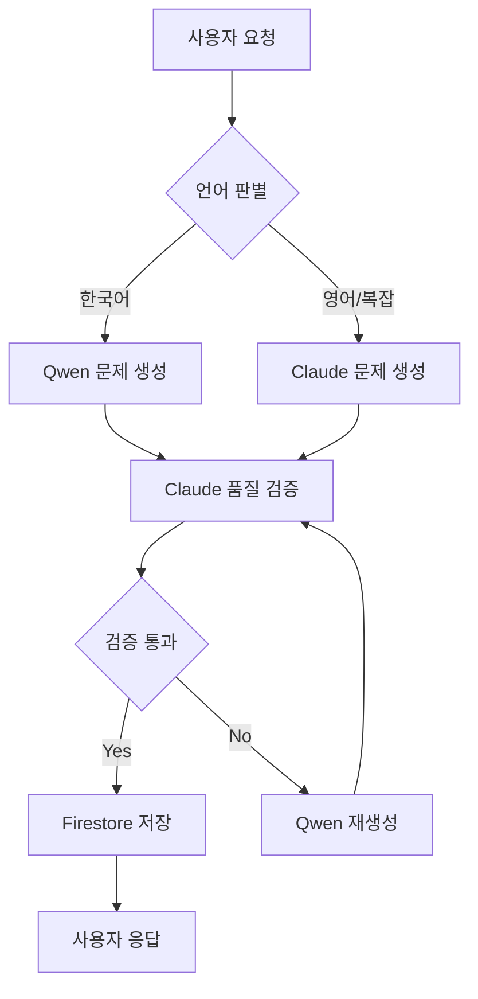

# 🤖 Qwen-Claude 협업 시스템 설계

## 📌 모델 사양
- **Qwen**: qwen3-max-preview (International Edition)
- **Claude**: Opus 4.1 (구독 무제한)
- **보조**: Gemini 1.5 Flash (백업용)

## 1. 🎯 모델별 전문 역할 정의

### Qwen3-Max-Preview 전문 영역
```yaml
model: qwen3-max-preview
specialization:
  primary:
    - 한국어 수학 문제 생성
    - 한국 교육과정 맞춤 콘텐츠
    - 한글 수식 표현 및 설명
    - 학년별 난이도 조정

  strengths:
    - 한국어 자연어 처리 우수
    - 수학 용어 한글화 정확
    - 맥락 이해력 높음
    - 빠른 응답 속도

  use_cases:
    - 초/중/고 한국어 수학 문제
    - 한글 풀이 과정 생성
    - 학생 질문 답변 (한국어)
```

### Claude Opus 4.1 전문 영역
```yaml
model: claude-opus-4.1
specialization:
  primary:
    - 복잡한 수학 로직 검증
    - 코드 생성 및 최적화
    - 문제 품질 평가
    - 학습 경로 설계

  strengths:
    - 긴 컨텍스트 처리 (200k 토큰)
    - 논리적 추론 능력
    - 코드 작성 및 디버깅
    - 다단계 작업 처리

  use_cases:
    - 문제 난이도 자동 평가
    - 오답 분석 및 피드백
    - 커리큘럼 생성
    - 시스템 아키텍처 설계
```

## 2. 🔄 협업 워크플로우

### 기본 협업 패턴


### 구체적 구현 코드
```javascript
// qwen-claude-orchestrator.js

class QwenClaudeOrchestrator {
  constructor() {
    this.qwen = new QwenAPI({
      apiKey: process.env.DASHSCOPE_API_KEY,
      model: 'qwen3-max-preview',
      endpoint: 'https://dashscope-intl.aliyuncs.com/api/v1/services/aigc/text-generation/generation'
    });

    this.claude = new ClaudeAPI({
      apiKey: process.env.CLAUDE_API_KEY,
      model: 'claude-opus-4.1',
      maxTokens: 200000
    });
  }

  // 1. 문제 생성 (Qwen 주도)
  async generateMathProblem(params) {
    const { grade, topic, difficulty, count, language } = params;

    // Step 1: Qwen으로 초기 문제 생성
    const qwenPrompt = this.buildQwenPrompt(grade, topic, difficulty, count);
    const rawProblems = await this.qwen.generate(qwenPrompt);

    // Step 2: Claude로 품질 검증 및 개선
    const validationPrompt = this.buildValidationPrompt(rawProblems, grade, difficulty);
    const validation = await this.claude.validate(validationPrompt);

    // Step 3: 검증 결과에 따른 처리
    if (validation.status === 'approved') {
      return {
        problems: validation.improvedProblems || rawProblems,
        metadata: {
          generatedBy: 'qwen3-max-preview',
          validatedBy: 'claude-opus-4.1',
          qualityScore: validation.score
        }
      };
    } else {
      // Claude의 피드백으로 Qwen 재생성
      return await this.regenerateWithFeedback(validation.feedback, params);
    }
  }

  // 2. Claude의 검증 프롬프트 구성
  buildValidationPrompt(problems, grade, difficulty) {
    return {
      role: 'system',
      content: `You are Claude Opus 4.1, an expert math education validator.

      Evaluate these math problems for grade ${grade} students:
      1. Check mathematical accuracy
      2. Verify appropriate difficulty level (${difficulty})
      3. Ensure clear problem statements
      4. Validate answer correctness
      5. Assess pedagogical value

      Return a JSON response with:
      {
        "status": "approved" | "needs_revision",
        "score": 0-100,
        "feedback": "specific improvements needed",
        "improvedProblems": [enhanced problems if needed]
      }`,

      problems: JSON.stringify(problems)
    };
  }

  // 3. Qwen 재생성 with Claude 피드백
  async regenerateWithFeedback(feedback, originalParams) {
    const enhancedPrompt = {
      role: 'system',
      content: `이전 생성한 문제에 대한 피드백:
      ${feedback}

      위 피드백을 반영하여 더 나은 문제를 생성해주세요.
      학년: ${originalParams.grade}
      주제: ${originalParams.topic}
      난이도: ${originalParams.difficulty}
      개수: ${originalParams.count}`,
    };

    return await this.qwen.generate(enhancedPrompt);
  }

  // 4. 복잡한 문제는 Claude가 생성
  async generateComplexProblem(requirements) {
    const claudePrompt = {
      role: 'system',
      content: `Generate a complex, multi-step math problem with the following requirements:
      ${JSON.stringify(requirements)}

      Include:
      - Problem statement
      - Step-by-step solution
      - Common mistakes to avoid
      - Learning objectives`,
    };

    const complexProblem = await this.claude.generate(claudePrompt);

    // Qwen으로 한국어 번역 (필요시)
    if (requirements.language === 'ko') {
      return await this.translateWithQwen(complexProblem);
    }

    return complexProblem;
  }

  // 5. 학습 경로 설계 (Claude 주도, Qwen 지원)
  async designLearningPath(studentProfile) {
    // Claude가 전체 커리큘럼 설계
    const curriculum = await this.claude.generate({
      role: 'system',
      content: `Design a personalized math learning path for:
      ${JSON.stringify(studentProfile)}

      Create a 3-month curriculum with:
      - Weekly topics
      - Difficulty progression
      - Practice problem counts
      - Assessment points`,
    });

    // Qwen이 각 주차별 한국어 문제 생성
    const weeklyProblems = [];
    for (const week of curriculum.weeks) {
      const problems = await this.qwen.generate({
        role: 'system',
        content: `${week.topic}에 대한 ${week.difficulty} 난이도 문제 ${week.problemCount}개 생성`,
      });
      weeklyProblems.push(problems);
    }

    return {
      curriculum,
      weeklyProblems,
      metadata: {
        designer: 'claude-opus-4.1',
        contentCreator: 'qwen3-max-preview'
      }
    };
  }
}
```

## 3. 🎨 실제 사용 시나리오

### 시나리오 1: 한국어 수학 문제 생성
```javascript
// 초등 6학년 일차방정식 문제 생성
const orchestrator = new QwenClaudeOrchestrator();

const result = await orchestrator.generateMathProblem({
  grade: 6,
  topic: '일차방정식',
  difficulty: 'medium',
  count: 5,
  language: 'ko'
});

// 결과
{
  problems: [
    {
      question: "철수는 사과를 x개 가지고 있고...",
      answer: "x = 7",
      explanation: "양변에서 3을 빼고...",
      generatedBy: "qwen3-max-preview",
      validatedBy: "claude-opus-4.1"
    }
  ],
  qualityScore: 92
}
```

### 시나리오 2: 복잡한 영어 문제 생성
```javascript
// 고등학생용 복잡한 미적분 문제
const complexProblem = await orchestrator.generateComplexProblem({
  grade: 12,
  topic: 'calculus',
  subtopic: 'integration by parts',
  difficulty: 'hard',
  includeRealWorldApplication: true,
  language: 'en'
});

// Claude가 생성한 고품질 문제
{
  problem: "A particle moves along a curve...",
  solution: {
    step1: "First, identify u and dv...",
    step2: "Apply integration by parts formula...",
    // ... 상세한 단계별 풀이
  },
  commonMistakes: [...],
  learningObjectives: [...]
}
```

### 시나리오 3: 오답 분석 및 피드백
```javascript
// 학생 답안 분석 (Claude 주도)
const analysis = await orchestrator.analyzeStudentAnswer({
  problem: originalProblem,
  studentAnswer: "x = 5",
  studentWork: "3x + 7 = 22, 3x = 15, x = 5",
  correctAnswer: "x = 5"
});

// Claude의 상세 분석
{
  isCorrect: true,
  score: 100,
  feedback: {
    ko: "잘했어요! 방정식의 양변에서...", // Qwen 번역
    en: "Excellent work! You correctly..." // Claude 원문
  },
  strengths: ["체계적인 풀이 과정"],
  areasToImprove: [],
  nextRecommendedTopic: "이차방정식"
}
```

## 4. 📊 성능 최적화 전략

### 병렬 처리
```javascript
// 대량 문제 생성시 병렬 처리
async function batchGenerate(topics) {
  const promises = topics.map(topic => {
    if (topic.language === 'ko') {
      return orchestrator.qwen.generate(topic);
    } else {
      return orchestrator.claude.generate(topic);
    }
  });

  const results = await Promise.all(promises);

  // Claude로 일괄 품질 검증
  return await orchestrator.claude.batchValidate(results);
}
```

### 캐싱 전략
```javascript
// Redis 캐싱으로 응답 속도 개선
class CachedOrchestrator extends QwenClaudeOrchestrator {
  async generateMathProblem(params) {
    const cacheKey = this.getCacheKey(params);

    // 캐시 확인
    const cached = await redis.get(cacheKey);
    if (cached) return JSON.parse(cached);

    // 생성 및 캐싱
    const result = await super.generateMathProblem(params);
    await redis.set(cacheKey, JSON.stringify(result), 'EX', 3600);

    return result;
  }
}
```

## 5. 💡 고급 협업 패턴

### 패턴 1: 교차 검증
```javascript
// Qwen과 Claude가 서로의 출력을 검증
async function crossValidation(problem) {
  const [qwenVersion, claudeVersion] = await Promise.all([
    orchestrator.qwen.generate(problem),
    orchestrator.claude.generate(problem)
  ]);

  // 두 모델의 답이 일치하는지 확인
  if (qwenVersion.answer === claudeVersion.answer) {
    return {
      problem: qwenVersion,  // 한국어 우선
      confidence: 'high',
      validatedBy: 'cross-validation'
    };
  } else {
    // 불일치시 Claude가 최종 판단
    return await orchestrator.claude.arbitrate(qwenVersion, claudeVersion);
  }
}
```

### 패턴 2: 적응형 난이도 조정
```javascript
// 학생 성과에 따른 실시간 난이도 조정
class AdaptiveLearning {
  async getNextProblem(studentId) {
    // Claude가 학생 프로필 분석
    const analysis = await this.claude.analyzeStudent(studentId);

    // Qwen이 맞춤형 문제 생성
    const problem = await this.qwen.generatePersonalized({
      difficulty: analysis.recommendedDifficulty,
      weakPoints: analysis.weakAreas,
      strongPoints: analysis.strongAreas
    });

    return problem;
  }
}
```

## 6. 🔐 보안 및 비용 관리

### API 키 관리
```javascript
// Google Secret Manager 사용
const secrets = {
  QWEN_API_KEY: await getSecret('qwen-api-key'),
  CLAUDE_API_KEY: await getSecret('claude-api-key')
};
```

### 비용 최적화
```javascript
// 모델별 비용 추적
class CostTracker {
  async track(model, tokens) {
    const costs = {
      'qwen3-max-preview': 0.001 * tokens / 1000,
      'claude-opus-4.1': 0.015 * tokens / 1000
    };

    await firestore.collection('usage').add({
      model,
      tokens,
      cost: costs[model],
      timestamp: new Date()
    });
  }
}
```

## 7. 📈 모니터링 및 분석

### 품질 메트릭
```yaml
quality_metrics:
  - problem_accuracy_rate
  - student_satisfaction_score
  - answer_validation_success_rate
  - generation_time_p95
  - model_agreement_rate
```

### 실시간 대시보드
```javascript
// 모델 성능 비교 대시보드
{
  qwen_metrics: {
    avg_response_time: "1.2s",
    success_rate: "94%",
    daily_problems: 850
  },
  claude_metrics: {
    avg_response_time: "2.8s",
    validation_accuracy: "98%",
    daily_validations: 850
  },
  collaboration_metrics: {
    cross_validation_agreement: "92%",
    quality_improvement: "+18%"
  }
}
```

## 8. 🚀 구현 로드맵

### Week 1-2: 기본 통합
- [ ] Qwen API 연동 완료 ✅
- [ ] Claude API 설정
- [ ] 기본 오케스트레이터 구현

### Week 3-4: 협업 로직
- [ ] 품질 검증 시스템
- [ ] 교차 검증 구현
- [ ] 캐싱 시스템

### Month 2: 고급 기능
- [ ] 적응형 학습
- [ ] 실시간 분석
- [ ] 비용 최적화

---
*설계 문서 작성일: 2025년 9월 13일*
*모델: Qwen3-Max-Preview + Claude Opus 4.1*