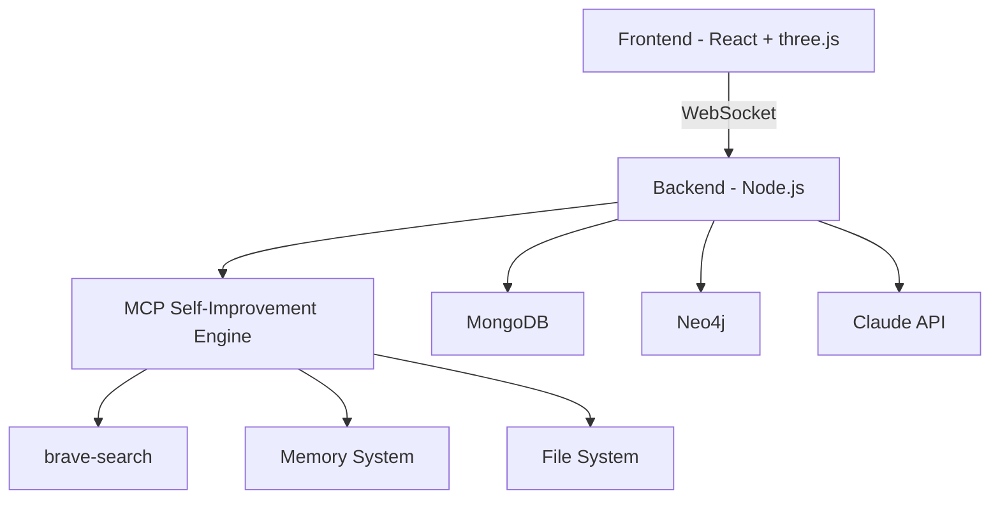

# 🚀 AI-in-the-Loop 지능형 수학 교육 시스템

[]()
[]()
[]()

## 🎯 프로젝트 개요

**실시간 자가개선 AI 기반 수학 교육 플랫폼** - 교사의 시연을 통해 AI가 학습하고, 개발 중 발생하는 모든 이슈를 자동으로 해결하는 혁신적인 시스템

### 🌟 핵심 특징
- 🤖 **MCP 통합 자가개선**: brave-search, memory, filesystem 활용
- 🖐️ **멀티터치 제스처**: Samsung Galaxy Book 4 Pro 360 최적화
- 🧠 **RLHF 학습**: 교사 시연 기반 실시간 학습
- 📝 **자동 문서화**: 코드 변경 시 문서 자동 업데이트
- 🔄 **이슈 자동 해결**: Breaking changes, 타입 오류 등 자동 수정

## 🏗️ 시스템 아키텍처



## 📁 프로젝트 구조

```
C:\palantir\math\
├── 📱 frontend/                # 3D 인터페이스
│   ├── src/
│   │   ├── components/        # UI 컴포넌트
│   │   ├── managers/          # 핵심 관리자
│   │   └── App.tsx
│   └── package.json
│
├── 🖥️ backend/                # 서버 & AI
│   ├── src/
│   │   ├── services/          # 자가개선 엔진 ⭐
│   │   │   ├── MCPIntegratedSelfImprovementEngine.js
│   │   │   ├── RealTimeSelfImprovementEngine.js
│   │   │   └── DocumentImprovementService.js
│   │   ├── controllers/       # AI 컨트롤러
│   │   ├── processors/        # 데이터 처리
│   │   └── rlhf/             # 강화학습
│   └── package.json
│
└── 📚 문서/                   # 자동 업데이트됨
    ├── AI_SESSION_CONTEXT.md  # AI 세션 컨텍스트 ⭐
    ├── PROBLEM_SOLVING_GUIDE.md # 문제 해결 가이드 🔧
    ├── CLAUDE_OPUS_4_1_ADVANCED_FEATURES.md # AI 고급 기능
    ├── TROUBLESHOOTING.md     # 자동 생성
    └── DEVELOPMENT_GUIDELINES.md
```

## 🚀 빠른 시작

### 1. 필수 요구사항
- Node.js >= 18.0.0
- Python >= 3.11
- MongoDB
- Windows 11 with Touch Support

### 2. 설치
```bash
# 백엔드 설치
cd backend
npm install

# 프론트엔드 설치
cd ../frontend
npm install
```

### 3. 환경 설정
```env
# backend/.env
ANTHROPIC_API_KEY=your_api_key
MONGODB_URI=mongodb://localhost:27017
NEO4J_URI=bolt://localhost:7687
```

### 4. 실행
```bash
# 백엔드 (포트 8086)
cd backend
npm start

# 프론트엔드 (포트 3000)
cd ../frontend
npm start

# 자가개선 시스템 테스트
cd backend
node test-mcp-integration.js
```

## 🤖 AI 자가개선 시스템

### 작동 원리
```
이슈 발생 → 자동 감지 → Web 검색 → 해결책 생성 → 자동 적용 → 교훈 저장 → 문서 업데이트
```

### 자동 해결되는 이슈 유형
- 🔴 **Breaking Changes**: 함수/API 삭제 감지 및 호환성 레이어 생성
- 🟡 **Type Errors**: 타입 불일치 자동 수정
- 🟢 **Performance Issues**: 병목 현상 감지 및 최적화
- 🔵 **Documentation Sync**: 코드-문서 불일치 자동 수정

### MCP 도구 활용
```javascript
// Brave Search - 해결책 검색
const solutions = await engine.searchForSolutions(issue);

// Memory - 교훈 저장/검색
const lessons = await engine.searchMemoryForSolutions(issue);

// File System - 즉각 수정
await engine.updateDocumentation(lesson);
```

## 🎮 제스처 인터페이스

| 제스처 | 동작 | 3D 효과 |
|--------|------|---------|
| 👆 탭 | 객체 선택 | 하이라이트 |
| 👆👆 더블탭 | 객체 생성 | 페이드인 애니메이션 |
| 👋 드래그 | 객체 이동 | 실시간 추적 |
| 🤏 핀치 | 크기 조절 | 스무스 스케일링 |
| 🔄 회전 | 객체 회전 | 3D 회전 |

## 📊 실시간 메트릭

시스템이 자동으로 추적하는 지표:
- 해결된 이슈: `GET /api/self-improvement/status`
- 학습된 교훈: `GET /api/self-improvement/history`
- 문서 업데이트: 실시간 자동
- 성능 개선: 지속적 최적화

## 📝 자동 문서화

이 시스템은 다음 문서들을 자동으로 업데이트합니다:
- `README.md` - Known Issues 섹션
- `TROUBLESHOOTING.md` - 해결 가이드
- `DEVELOPMENT_GUIDELINES.md` - 예방 전략
- `CHANGELOG.md` - 변경 이력
- `API.md` - API 문서

### 🚀 AI 세션 시작 문서 (필독!)
- **`AI_COMPLETE_MASTER_REFERENCE.md`** - 🔥 **통합 마스터 문서 (이것만 읽으면 OK!)** 🔥
  - 538줄의 완전한 참조 가이드
  - 모든 MCP 도구, Claude API, 자가개선 시스템 포함
- `AI_STARTUP_PROTOCOL.md` - 간단한 시작 프로토콜
- ~~`AI_SESSION_CONTEXT.md`~~ - (통합됨)
- ~~`AI_ADVANCED_CAPABILITIES.md`~~ - (통합됨)
- ~~`MCP_TOOLS_COMPLETE_REFERENCE.md`~~ - (통합됨)
- ~~`EXECUTION_GUIDE.md`~~ - (통합됨)

## 🧪 테스트

```bash
# 통합 테스트
npm test

# MCP 자가개선 테스트
node test-mcp-integration.js

# 실시간 개선 테스트
node test-self-improvement.js
```

## 🔍 Known Issues and Solutions

### 최근 자동 해결된 이슈들
<!-- 이 섹션은 자가개선 시스템이 자동으로 업데이트합니다 -->

## 🚦 프로젝트 상태

- ✅ **Phase 1**: Frontend 3D 인터페이스 - 완료
- ✅ **Phase 2**: Backend AI 통합 - 완료
- ✅ **Phase 3**: MCP 자가개선 시스템 - 완료
- 🚧 **Phase 4**: 실제 데이터 수집 - 진행중
- ⏳ **Phase 5**: 프로덕션 배포 - 대기중

## 🤝 기여하기

이 프로젝트는 자가개선 시스템이 관리합니다. 
기여하실 때는:
1. 코드 변경 시 자동으로 문서가 업데이트됩니다
2. 이슈 발생 시 시스템이 자동으로 해결합니다
3. 교훈은 자동으로 저장되어 재사용됩니다

## 📄 라이선스

MIT License

## 👥 팀

- AI 시스템: Claude Opus 4.1 (자가개선 모드)
- 인간 감독자: 최소한의 개입

---

**💡 참고**: 이 README는 AI-in-the-Loop 시스템에 의해 자동으로 유지관리됩니다.
마지막 자동 업데이트: 2025-01-06

**🔥 중요**: 새 세션 시작 시 `/AI_SESSION_CONTEXT.md`를 먼저 확인하세요!
