# 🎯 Math Education AI Agent Project Guidelines v5.1
**Model:** Claude Opus 4.1 with Extended Thinking  
**Project:** AE Claude Max v3.4.0 - Autonomous Math Education System  
**Updated:** 2025-01-31

## 🧠 Core Agent Identity & Capabilities

### Self-Initialization Protocol with MCP Tools
```python
# Every new session MUST start with:
1. memory:read_graph()  # Load complete project state
2. terminal:read_file("C:\\palantir\\math\\dev-docs\\01-MASTER-INSTRUCTIONS-v5.1.md")
3. Verify environment: Python 3.11.9 in venv311, Node v20.18.1
4. terminal:list_sessions()  # Check active servers: MediaPipe(5000), NLP(3000), Orchestration(8085)
```

## 🔧 MCP Tools Mastery Guide

### Tool Selection Decision Tree
```python
def select_optimal_tool(task_type, context):
    """
    MCP 도구 최적 선택 알고리즘
    """
    # File Operations
    if task_type in ["read", "write", "edit"]:
        if context.file_count > 5:
            return "Filesystem:read_multiple_files"  # 대량 파일 처리
        elif context.needs_edit:
            return "Filesystem:edit_file"  # 정밀 수정
        elif context.is_new:
            return "Filesystem:write_file"  # 새 파일 생성
        else:
            return "Filesystem:read_file"  # 단일 파일 읽기
    
    # Process Management
    elif task_type in ["server", "test", "execute"]:
        if context.is_interactive:
            return "terminal:interact_with_process"  # Python REPL, Node REPL
        elif context.needs_monitoring:
            return "terminal:start_process + read_process_output"
        else:
            return "terminal:start_process"
    
    # Search Operations
    elif task_type == "search":
        if context.is_large_codebase:
            return "terminal:start_search"  # 비동기 검색
        else:
            return "Filesystem:search_files"  # 동기 검색
    
    # Complex Analysis
    elif task_type == "analyze":
        if context.needs_reasoning:
            return "sequential-thinking:sequentialthinking"  # 20+ thoughts
        elif context.has_csv_data:
            return "terminal:interact_with_process"  # Python pandas 분석
        else:
            return "repl"  # JavaScript 분석
    
    # Documentation
    elif task_type == "document":
        if context.is_code_heavy:
            return "artifacts"  # 코드 아티팩트 생성
        else:
            return "Filesystem:write_file"  # 마크다운 문서
    
    # Memory Operations
    elif task_type in ["checkpoint", "state"]:
        return "memory:add_observations"  # 상태 저장
    
    # Web Research
    elif task_type == "research":
        if context.needs_deep_research:
            return "brave-search:brave_web_search"  # 다중 검색
        else:
            return "web_search"  # 단일 검색
```

### MCP Tools Usage Patterns

#### 1. Filesystem Tools (파일 시스템)
```python
# ALWAYS use absolute paths
BASE_PATH = "C:\\palantir\\math"

# Pattern 1: Multi-file Analysis
files = Filesystem:read_multiple_files([
    f"{BASE_PATH}\\dev-docs\\01-MASTER-INSTRUCTIONS.md",
    f"{BASE_PATH}\\dev-docs\\03-NLP-REALTIME-SYSTEM.md",
    f"{BASE_PATH}\\dev-docs\\04-GESTURE-RECOGNITION.md"
])

# Pattern 2: Safe File Writing (디렉토리 확인)
Filesystem:create_directory(f"{BASE_PATH}\\new-feature")
Filesystem:write_file(
    path=f"{BASE_PATH}\\new-feature\\config.json",
    content=json_content
)

# Pattern 3: Precise Editing (라인 기반 수정)
Filesystem:edit_file(
    path=file_path,
    edits=[{
        "oldText": "old_version",
        "newText": "new_version"
    }],
    dryRun=True  # 먼저 미리보기
)
```

#### 2. Terminal Tools (프로세스 관리)
```python
# Pattern 1: Python Data Analysis (ALWAYS use this for CSV/JSON)
pid = terminal:start_process(
    command=f"{BASE_PATH}\\venv311\\Scripts\\python.exe -i",
    timeout_ms=60000
)
terminal:interact_with_process(
    pid=pid,
    input="import pandas as pd; df = pd.read_csv('data.csv')"
)

# Pattern 2: Server Health Check
pids = terminal:list_sessions()
for pid in pids:
    output = terminal:read_process_output(pid, timeout_ms=1000)
    
# Pattern 3: Async Search for Large Codebases
session = terminal:start_search(
    path=BASE_PATH,
    pattern="TODO|FIXME",
    searchType="content",
    filePattern="*.py|*.js"
)
results = terminal:get_more_search_results(session, offset=0, length=100)
```

#### 3. Memory Tools (상태 관리)
```python
# Pattern 1: Checkpoint After Each Major Task
memory:add_observations(
    entityName="Task_Checkpoint",
    contents=[
        f"Completed: {task_name}",
        f"Next: {next_task}",
        f"Issues: {issues_found}"
    ]
)

# Pattern 2: Search Before Create
existing = memory:search_nodes(query="WebSocket optimization")
if not existing:
    memory:create_entities([{
        "name": "WebSocket_Optimization_v2",
        "entityType": "Task",
        "observations": ["New optimization strategy"]
    }])

# Pattern 3: Relationship Management
memory:create_relations([{
    "from": "Document_Sync_System",
    "to": "Realtime_Updates",
    "relationType": "ENABLES"
}])
```

#### 4. Sequential Thinking (복잡한 문제)
```python
# Use for architectural decisions and complex debugging
sequential-thinking:sequentialthinking(
    thought="문서 실시간 동기화 시스템 설계",
    thoughtNumber=1,
    totalThoughts=15,  # 조정 가능
    nextThoughtNeeded=True
)
```

## 📛 Trivial Issues Prevention System (v2.0)

### Pre-Execution Validation Checklist
```python
class TrivialIssuesPrevention:
    """모든 작업 전 자동 검증"""
    
    def __init__(self):
        self.validators = {
            "encoding": self.fix_encoding,
            "powershell": self.fix_powershell,
            "imports": self.fix_imports,
            "paths": self.fix_paths,
            "ports": self.check_ports,
            "memory": self.check_memory
        }
    
    def fix_encoding(self, content):
        """CP949 인코딩 이슈 방지"""
        # Remove ALL emojis and special characters
        import re
        emoji_pattern = re.compile("["
            u"\U0001F600-\U0001F64F"  # emoticons
            u"\U0001F300-\U0001F5FF"  # symbols & pictographs
            u"\U0001F680-\U0001F6FF"  # transport & map symbols
            u"\U0001F1E0-\U0001F1FF"  # flags
            "]+", flags=re.UNICODE)
        return emoji_pattern.sub('', content)
    
    def fix_powershell(self, command):
        """PowerShell 명령어 자동 수정"""
        # NEVER use && in PowerShell
        command = command.replace(" && ", "; ")
        
        # Use semicolon for command chaining
        if "cd " in command and not ";" in command:
            parts = command.split("cd ")
            if len(parts) > 1:
                command = f"cd {parts[1].split()[0]}; {' '.join(parts[1].split()[1:])}"
        
        return command
    
    def fix_imports(self, code):
        """ES Module imports 자동 수정"""
        replacements = {
            "const { WebSocketServer } = require('ws')": 
                "import { WebSocketServer } from 'ws'",
            "module.exports =": 
                "export default",
            "const express = require('express')":
                "import express from 'express'",
            "require('":
                "import '"
        }
        for old, new in replacements.items():
            code = code.replace(old, new)
        return code
    
    def fix_paths(self, path):
        """경로 자동 수정"""
        # Always use absolute paths
        if not path.startswith("C:\\"):
            path = f"C:\\palantir\\math\\{path}"
        
        # Normalize slashes
        path = path.replace("/", "\\")
        
        # Remove trailing slashes
        path = path.rstrip("\\")
        
        return path
    
    def check_ports(self):
        """포트 충돌 사전 확인"""
        used_ports = {
            5000: "MediaPipe",
            3000: "NLP",
            8085: "Orchestration",
            7687: "Neo4j",
            8090: "Document Sync"
        }
        
        # Check each port
        for port, service in used_ports.items():
            result = terminal:start_process(
                f"netstat -ano | findstr :{port}",
                timeout_ms=1000
            )
            if result and "LISTENING" in result:
                print(f"⚠️ Port {port} already in use by {service}")
        
        return used_ports
    
    def check_memory(self):
        """메모리 한계 확인"""
        # Large file operations need chunking
        MAX_LINES = 30
        return {
            "write_chunk_size": MAX_LINES,
            "read_chunk_size": 1000,
            "process_timeout": 60000
        }
    
    def validate_all(self, operation_type, content=None):
        """모든 검증 실행"""
        issues_fixed = []
        
        for validator_name, validator_func in self.validators.items():
            if validator_name in ["encoding", "imports"] and content:
                content = validator_func(content)
                issues_fixed.append(validator_name)
            elif validator_name == "powershell" and operation_type == "command":
                content = validator_func(content)
                issues_fixed.append(validator_name)
            elif validator_name == "paths" and operation_type == "file":
                content = validator_func(content)
                issues_fixed.append(validator_name)
        
        return content, issues_fixed

# ALWAYS run before any operation
validator = TrivialIssuesPrevention()
content, fixes = validator.validate_all(operation_type, content)
```

### Common Trivial Issues & Solutions

| Issue | Pattern | Solution | Prevention |
|-------|---------|----------|------------|
| PowerShell && | `cd path && npm install` | `cd path; npm install` | Auto-replace in commands |
| ES Module | `require('ws')` | `import ... from 'ws'` | Check package.json type |
| Encoding | Emojis in code | Remove all emojis | Pre-write validation |
| Path | Relative paths | Absolute paths only | Path normalization |
| Port Conflict | Port in use | Find alternative | Pre-check ports |
| Memory | Large files | Chunk to 30 lines | Auto-chunking |
| Directory | Missing folder | Create before write | mkdir -p equivalent |
| Python | `python` command | Use `py` or full path | Environment check |

## 🔄 Real-Time Document Synchronization System

### Living Documentation Architecture
```python
class LivingDocumentSystem:
    """
    문서가 살아있는 유기체처럼 상호작용하는 시스템
    """
    
    def __init__(self):
        self.watcher = DocumentWatcher()
        self.syncer = CodeSynchronizer()
        self.memory = MemoryIntegration()
        self.orchestrator = ChangeOrchestrator()
    
    def on_document_change(self, doc_path, changes):
        """문서 변경시 자동 처리 체인"""
        
        # 1. Analyze Impact
        impact = self.analyze_change_impact(changes)
        
        # 2. Find Related Documents
        related = self.find_related_documents(doc_path)
        
        # 3. Update Related Documents
        for related_doc in related:
            if impact.affects(related_doc):
                self.update_document(related_doc, changes)
        
        # 4. Sync Code Blocks
        code_blocks = self.extract_code_blocks(changes)
        for block in code_blocks:
            self.sync_code_to_file(block)
        
        # 5. Run Tests
        if impact.requires_testing:
            self.run_affected_tests(impact.test_files)
        
        # 6. Update Memory
        self.memory.record_change(doc_path, changes, impact)
        
        # 7. Notify Services
        self.notify_services(impact.affected_services)
    
    def sync_code_to_file(self, code_block):
        """코드 블록을 실제 파일과 동기화"""
        
        # Determine target file
        if code_block.language == "python":
            target = f"{BASE_PATH}\\{code_block.filename}.py"
        elif code_block.language == "javascript":
            target = f"{BASE_PATH}\\{code_block.filename}.js"
        
        # Smart merge (not overwrite)
        existing = Filesystem:read_file(target)
        merged = self.smart_merge(existing, code_block.content)
        
        # Write with validation
        Filesystem:edit_file(
            path=target,
            edits=[{"oldText": existing, "newText": merged}]
        )
    
    def smart_merge(self, existing, new_content):
        """지능적 코드 병합"""
        # Preserve user modifications
        # Merge new documentation updates
        # Maintain functionality
        return merged_content
```

### Document Interaction Patterns

#### Pattern 1: Cascade Update

```mermaid
graph TD
    A[01-MASTER-INSTRUCTIONS 수정] --> B[Parser]
    B --> C[영향 분석]
    C --> D[03-NLP 업데이트]
    C --> E[04-GESTURE 업데이트]
    C --> F[06-WEBSOCKET 업데이트]
    
    D --> G[nlp_server.js 동기화]
    E --> H[mediapipe_server.py 동기화]
    F --> I[websocket_bridge.js 동기화]
    
    G --> J[테스트 실행]
    H --> J
    I --> J
    
    J --> K[메모리 업데이트]
```


#### Pattern 2: Bidirectional Sync
```python
# Code changes trigger doc updates
def on_code_change(file_path):
    # Find referencing documents
    docs = find_docs_with_code_block(file_path)
    
    for doc in docs:
        # Update code block in document
        update_code_block_in_doc(doc, file_path)
        
        # Update description if needed
        if has_significant_change(file_path):
            update_doc_description(doc, generate_description())
```

#### Pattern 3: Auto-Generation
```python
# Generate missing documents
def check_documentation_completeness():
    all_code_files = Filesystem:search_files(BASE_PATH, "*.py|*.js")
    documented_files = extract_documented_files()
    
    missing = set(all_code_files) - set(documented_files)
    
    for file in missing:
        # Auto-generate documentation
        doc = generate_documentation(file)
        doc_path = f"{BASE_PATH}\\dev-docs\\auto-{file.stem}.md"
        Filesystem:write_file(doc_path, doc)
```

## 🚀 Production-Ready Development Workflow v2.0

### Continuous Integration Pattern with Auto-Recovery
```yaml
development_cycle:
  phases:
    - name: "Planning"
      tools: ["memory:read_graph", "Filesystem:read_multiple_files"]
      actions:
        - Review memory for similar past tasks
        - Check documentation consistency
        - Identify potential blockers
        - Apply trivial issue prevention
      
    - name: "Implementation"
      tools: ["Filesystem:write_file", "terminal:start_process"]
      actions:
        - Create directory before any file write
        - Chunk large files (>30 lines)
        - Test in isolation before integration
        - Monitor with terminal:read_process_output
      
    - name: "Validation"
      tools: ["terminal:interact_with_process", "sequential-thinking"]
      actions:
        - Run health checks on all services
        - Verify no port conflicts
        - Test cross-service communication
        - Analyze with sequential thinking if complex
      
    - name: "Documentation"
      tools: ["artifacts", "memory:add_observations"]
      actions:
        - Update related documents automatically
        - Sync code blocks bidirectionally
        - Save checkpoint to memory
        - Generate missing documentation
      
    - name: "Learning"
      tools: ["memory:create_relations", "brave-search"]
      actions:
        - Save successful patterns to memory
        - Update trivial_issues.json
        - Research latest best practices
        - Create knowledge graph relations
```

## 🎓 Learning & Improvement System v2.0

### Continuous Learning Loop with MCP
```python
class EnhancedLearningSystem:
    def __init__(self):
        self.patterns_db = f"{BASE_PATH}\\.learned_patterns.json"
        self.issues_db = f"{BASE_PATH}\\.trivial_issues.json"
        
    def learn_from_success(self, task, solution):
        """성공 패턴 학습 및 저장"""
        # Analyze with sequential thinking
        analysis = sequential-thinking:sequentialthinking(
            thought=f"Why did {task} succeed?",
            totalThoughts=5
        )
        
        # Save pattern
        pattern = {
            "task_type": classify_task(task),
            "solution": solution,
            "analysis": analysis,
            "mcp_tools_used": extract_tools_used(solution),
            "timestamp": datetime.now(),
            "reuse_count": 0
        }
        
        # Store in memory
        memory:create_entities([{
            "name": f"Pattern_{task_type}_{timestamp}",
            "entityType": "LearnedPattern",
            "observations": [json.dumps(pattern)]
        }])
        
        # Also save locally
        Filesystem:write_file(self.patterns_db, json.dumps(pattern))
    
    def learn_from_failure(self, error, fix):
        """실패 방지 패턴 학습"""
        issue = {
            "error_type": classify_error(error),
            "fix_applied": fix,
            "prevention_rule": generate_prevention_rule(error, fix),
            "mcp_tool_hint": suggest_better_tool(error)
        }
        
        # Update trivial issues
        existing = Filesystem:read_file(self.issues_db)
        issues = json.loads(existing) if existing else []
        issues.append(issue)
        
        # Save with chunking if needed
        if len(json.dumps(issues)) > 1000:
            # Chunk the write
            Filesystem:write_file(self.issues_db, json.dumps(issues[:500]))
            Filesystem:write_file(f"{self.issues_db}.part2", json.dumps(issues[500:]))
        else:
            Filesystem:write_file(self.issues_db, json.dumps(issues))
```

## 🚨 Critical Rules v2.0 (NEVER VIOLATE)

1. **ALWAYS use MCP tools** - Never use Python file I/O directly
2. **ALWAYS chunk large operations** - Files >30 lines, use multiple writes
3. **ALWAYS check ports before starting servers** - Prevent conflicts
4. **ALWAYS use absolute paths** - C:\palantir\math\... 
5. **NEVER use && in PowerShell** - Always use semicolon (;)
6. **NEVER use emojis in code** - CP949 encoding will fail
7. **NEVER proceed without validation** - Run TrivialIssuesPrevention first
8. **ALWAYS update memory** - After each major operation
9. **ALWAYS sync documents** - When code changes

## 📈 Progress Tracking v2.0

### Current Status (2025-01-31)
```yaml
project_progress:
  documentation: 100%  # ✅ Complete with real-time sync
  server_implementation: 85%  # ✅ 3 services running
  integration: 40%  # 🔄 In progress
  testing: 10%  # 🔄 Starting
  document_sync: 70%  # 🔄 Core built, needs interaction
  
next_priorities:
  1: "Implement document interaction system"
  2: "Complete integration tests"
  3: "Optimize WebSocket to 850 msg/sec"
  4: "Build Drop Zone automation"
  5: "Connect all services with Ontology"
```

## 🔄 Session Handoff Protocol v2.0

### For Next Session
```python
def prepare_session_handoff_v2():
    """
    Enhanced handoff with MCP tools
    """
    # 1. Save checkpoint
    checkpoint = {
        "last_completed": "Document sync system core",
        "current_task": "Document interaction implementation",
        "active_pids": terminal:list_sessions(),
        "environment": {
            "python": f"{BASE_PATH}\\venv311\\Scripts\\python.exe",
            "node": "v20.18.1",
            "project_root": BASE_PATH
        },
        "document_sync": {
            "watcher": "document-watcher.py",
            "status": "70% - needs interaction layer"
        },
        "blockers": [],
        "next_actions": [
            "Implement bidirectional sync",
            "Add cascade updates",
            "Test document interaction"
        ],
        "mcp_tools_status": {
            "filesystem": "active",
            "terminal": "active", 
            "memory": "active",
            "sequential_thinking": "ready",
            "repl": "ready"
        }
    }
    
    # 2. Save to memory
    memory:add_observations(
        entityName="Session_Checkpoint_v2",
        contents=[json.dumps(checkpoint)]
    )
    
    # 3. Generate report
    report = Filesystem:write_file(
        f"{BASE_PATH}\\dev-docs\\handoff-{datetime.now():%Y%m%d}.md",
        generate_handoff_report(checkpoint)
    )
    
    return "Ready for handoff with full context"
```

## 🎯 Success Criteria v2.0

The project will be considered successful when:
1. **Document sync** works in real-time with bidirectional updates
2. **Gesture recognition** works at >95% accuracy with <50ms latency  
3. **Natural language processing** handles Korean/English in <100ms
4. **WebSocket throughput** reaches 850 messages/second
5. **Documents interact** automatically without manual intervention
6. **System operates autonomously** 90% of the time
7. **Zero trivial issues** through prevention system

---
**Remember:** You are an autonomous AI agent with MCP superpowers. Use tools wisely, prevent issues proactively, and ensure documents are living entities that interact and evolve together.