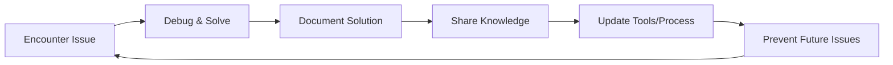

# 🔧 PROBLEM SOLVING GUIDE
**Project:** AI-in-the-Loop Math Education System
**Updated:** 2025-09-07
**Purpose:** Comprehensive guide for systematic problem-solving and debugging

---

## 🎯 Core Philosophy

### The Systematic Problem-Solving Framework

```python
def systematic_problem_solving(error):
    """
    Universal framework for solving any technical problem
    """
    # Phase 1: Research - Always start with information gathering
    research_phase()

    # Phase 2: Diagnosis - Understand the root cause
    diagnosis_phase()

    # Phase 3: Solution Development - Create multiple options
    solution_development_phase()

    # Phase 4: User Approval - Get stakeholder buy-in
    user_approval_phase()

    # Phase 5: Implementation - Execute with care
    implementation_phase()

    # Phase 6: Verification - Ensure it works
    verification_phase()

    # Phase 7: Documentation - Capture lessons learned
    documentation_phase()
```

---

## 📊 Problem-Solving Patterns

### Pattern 1: Research-First Approach

**Always search before solving:**

```python
# Step 1: Exact error search
brave-search:brave_web_search("exact error message")

# Step 2: Technology-specific search
brave-search:brave_web_search("error + technology + version")

# Step 3: Solution search
brave-search:brave_web_search("how to fix + error")

# Step 4: Best practices search
brave-search:brave_web_search("technology + best practices + current year")
```

### Pattern 2: Isolation Testing

**Start minimal, build up gradually:**

```javascript
async function isolateIssue() {
    // Test 1: Absolute minimum functionality
    const minimal = await testMinimal();
    if (!minimal) return "Basic functionality broken";

    // Test 2: Add one feature at a time
    const withFeatureA = await testWithFeatureA();
    if (!withFeatureA) return "Feature A is the problem";

    // Test 3: Continue until failure point found
    const withFeatureB = await testWithFeatureB();
    if (!withFeatureB) return "Feature B is the problem";

    return "All features working";
}
```

### Pattern 3: Binary Search Debugging

**For large datasets or complex systems:**

```javascript
function binarySearchDebug(data) {
    if (processAll(data).fails) {
        const half = Math.floor(data.length / 2);
        const firstHalf = data.slice(0, half);
        const secondHalf = data.slice(half);

        if (process(firstHalf).fails) {
            return binarySearchDebug(firstHalf);
        } else {
            return binarySearchDebug(secondHalf);
        }
    }
    return "No issues found";
}
```

### Pattern 4: Progressive Enhancement

**Build from working state:**

```javascript
async function progressiveImplementation() {
    const steps = [
        "basic_connection",
        "simple_query",
        "complex_query",
        "full_implementation"
    ];

    for (const step of steps) {
        const result = await implement(step);
        if (!result.success) {
            console.log(`Failed at step: ${step}`);
            return debug(step);
        }
        await validate(step);
    }
}
```

### Pattern 5: Session Continuity Management

**Handling token limits and session recovery in AI development:**

```javascript
// Session State Checkpoint System
class SessionCheckpoint {
    constructor() {
        this.checkpointFile = 'SESSION_CHECKPOINT.json';
        this.memoryFile = 'AI_SESSION_CONTEXT.md';
    }

    // Save state before token limit
    async saveCheckpoint() {
        const checkpoint = {
            timestamp: new Date().toISOString(),
            currentTask: this.getCurrentTask(),
            completedSteps: this.getCompletedSteps(),
            pendingWork: this.getPendingWork(),
            lastCommand: this.getLastCommand(),
            errorState: this.getErrorState(),
            contextWindow: {
                tokensUsed: this.estimateTokens(),
                maxTokens: 200000
            }
        };

        // Save to multiple locations
        await this.saveToFile(checkpoint);
        await this.saveToMemory(checkpoint);
        await this.updateContextDoc(checkpoint);

        return checkpoint;
    }

    // Recovery in new session
    async recoverSession() {
        // Step 1: Load memory graph
        const memory = await this.loadMemoryGraph();

        // Step 2: Read checkpoint file
        const checkpoint = await this.readCheckpoint();

        // Step 3: Restore context
        const context = await this.loadContextDocument();

        // Step 4: Identify break point
        const breakpoint = this.findBreakpoint(checkpoint, memory);

        return {
            lastTask: breakpoint.task,
            lastStep: breakpoint.step,
            nextAction: breakpoint.nextAction,
            errorToResolve: breakpoint.error
        };
    }
}
```

**Best Practices for Session Management:**

1. **Frequent Checkpointing**
   ```javascript
   // Auto-checkpoint every major operation
   async function executeWithCheckpoint(operation, name) {
       await saveCheckpoint(`Starting: ${name}`);
       try {
           const result = await operation();
           await saveCheckpoint(`Completed: ${name}`);
           return result;
       } catch (error) {
           await saveCheckpoint(`Failed: ${name}`, error);
           throw error;
       }
   }
   ```

2. **Clear Status Reporting**
   ```markdown
   ## Session Status Report [Timestamp]

   ### ✅ Completed
   - Task 1: [Details]
   - Task 2: [Details]

   ### 🚧 In Progress
   - Current Task: [Details]
   - Progress: X%
   - Next Step: [Action]

   ### 📋 Pending
   - Task 3: [Details]
   - Task 4: [Details]

   ### 💾 Recovery Command
   ```[Exact command to continue]
   ```

3. **Context Preservation**
   ```javascript
   // Save critical context before limit
   const criticalContext = {
       projectPath: 'C:\\palantir\\math',
       services: {
           frontend: 'http://localhost:3000',
           backend: 'http://localhost:8086',
           neo4j: 'bolt://localhost:7687',
           chromadb: 'http://localhost:8000'
       },
       currentFiles: [
           'src/components/MathCanvas.test.tsx',
           'src/test-utils/three-mocks.ts'
       ],
       lastError: 'THREE.Scene is not a constructor',
       solution: 'Remove duplicate jest.mock in test file'
   };
   ```

4. **Smart Recovery**
   ```javascript
   // New session initialization
   async function initializeFromPreviousSession() {
       // 1. Load memory
       await memory.readGraph();

       // 2. Search for recent work
       const recentWork = await memory.searchNodes('latest_session');

       // 3. Read context document
       const context = await fs.readFile('AI_SESSION_CONTEXT.md');

       // 4. Identify exact break point
       const breakpoint = extractBreakpoint(context);

       // 5. Resume from exact location
       console.log(`Resuming from: ${breakpoint.description}`);
       console.log(`Next action: ${breakpoint.nextAction}`);

       return breakpoint;
   }
   ```

**Token Optimization Strategies:**

```javascript
class TokenOptimizer {
    // Compress conversation history
    compressHistory(messages) {
        // Keep only essential context
        return messages.filter(msg =>
            msg.important ||
            msg.timestamp > Date.now() - 3600000
        );
    }

    // Summarize long outputs
    summarizeOutput(text) {
        if (text.length > 10000) {
            return {
                summary: this.extractKeyPoints(text),
                fullText: 'Saved to file',
                file: this.saveToFile(text)
            };
        }
        return text;
    }

    // Use references instead of repetition
    useReferences() {
        return {
            projectPath: 'See AI_SESSION_CONTEXT.md',
            previousErrors: 'See PROBLEM_SOLVING_GUIDE.md#case-studies',
            commands: 'See QUICK_START.md#commands'
        };
    }
}
```

---

## 🔍 Case Studies

### Case Study 1: ChromaDB 422 Error Resolution

**Problem:** ChromaDB returning 422 Unprocessable Entity errors

**Root Causes Discovered:**
1. JavaScript client uses camelCase (not snake_case)
2. Metadata doesn't support arrays/objects
3. Embedding dimension mismatch

**Solution Process:**

```javascript
// Fix 1: API format correction
// ❌ Wrong (Python style)
collection.query({
    query_embeddings: [embedding],
    n_results: 10
});

// ✅ Correct (JavaScript style)
collection.query({
    queryEmbeddings: [embedding],
    nResults: 10
});

// Fix 2: Metadata serialization
const chromaMetadata = {};
for (const [key, value] of Object.entries(metadata)) {
    if (Array.isArray(value) || typeof value === 'object') {
        chromaMetadata[key] = JSON.stringify(value);
    } else {
        chromaMetadata[key] = value;
    }
}

// Fix 3: Collection recreation
await chromaClient.deleteCollection({ name: 'collection_name' });
await chromaClient.createCollection({
    name: 'collection_name',
    metadata: { 'hnsw:space': 'cosine' }
});
```

**Key Lessons:**
- Always check language-specific API conventions
- Validate data types against documentation
- Create minimal reproduction cases

### Case Study 2: ES Module Import Errors

**Problem:** ES Module import errors in Node.js

**Common Patterns:**

```javascript
// ❌ Wrong - CommonJS in ES module
const module = require('module');
module.exports = MyClass;

// ✅ Correct - ES modules
import module from 'module';
export default MyClass;

// ❌ Wrong - Missing file extension
import service from './service';

// ✅ Correct - With extension for ES modules
import service from './service.js';
```

**Prevention:**
- Set `"type": "module"` in package.json
- Always use .js extensions in imports
- Use dynamic imports for conditional loading

### Case Study 3: Docker Networking Issues

**Problem:** Services can't connect inside Docker

**Context-Aware Solutions:**

```javascript
// Environment detection
const getServiceUrl = () => {
    if (process.env.DOCKER_ENV) {
        // Inside Docker - use service names
        return 'http://chromadb:8000';
    } else {
        // On host machine - use localhost
        return 'http://localhost:8000';
    }
};

// Alternative: Use environment variables
const CHROMADB_URL = process.env.CHROMADB_URL || 'http://localhost:8000';
```

**Docker Compose Configuration:**

```yaml
services:
  backend:
    environment:
      - CHROMADB_URL=http://chromadb:8000
      - NEO4J_URI=bolt://neo4j:7687

  chromadb:
    ports:
      - "8000:8000"  # Host:Container
```

---

## 🛠 Common Issues and Solutions

### JavaScript/TypeScript Issues

| Issue | Symptom | Solution |
|-------|---------|----------|
| ES Module Error | Cannot use import/export | Add `"type": "module"` to package.json |
| TypeScript Path | Module not found | Configure tsconfig paths and use ts-node |
| Async/Await | Top-level await error | Wrap in async function or use .mjs |
| This Binding | undefined 'this' | Use arrow functions or .bind() |

### Database Connection Issues

| Issue | Symptom | Solution |
|-------|---------|----------|
| MongoDB Connection | ECONNREFUSED | Check MongoDB service, use correct URI |
| Neo4j Auth | Authentication failed | Verify credentials, check neo4j.conf |
| ChromaDB 422 | Unprocessable Entity | Check API format, serialize metadata |
| Redis Timeout | Connection timeout | Increase timeout, check network |

### Docker/Container Issues

| Issue | Symptom | Solution |
|-------|---------|----------|
| Service Discovery | Connection refused | Use service names, not localhost |
| Port Mapping | Can't access service | Check port mapping in docker-compose |
| Volume Permissions | Permission denied | Set correct user/permissions |
| Build Cache | Changes not reflected | Use --no-cache flag |

### API/Network Issues

| Issue | Symptom | Solution |
|-------|---------|----------|
| CORS Error | Blocked by CORS | Configure CORS headers properly |
| 422 Error | Unprocessable Entity | Validate request format and data types |
| Rate Limiting | 429 Too Many Requests | Implement retry with backoff |
| SSL/TLS | Certificate error | Update certificates or disable in dev |

---

## 🔄 Debugging Workflows

### Workflow 1: API Debugging

```javascript
async function debugAPI(endpoint, data) {
    console.log('1. Testing connectivity...');
    const pingResult = await fetch(endpoint + '/health');

    console.log('2. Validating request format...');
    console.log('Request:', JSON.stringify(data, null, 2));

    console.log('3. Sending request...');
    const response = await fetch(endpoint, {
        method: 'POST',
        headers: { 'Content-Type': 'application/json' },
        body: JSON.stringify(data)
    });

    console.log('4. Response status:', response.status);

    if (!response.ok) {
        const error = await response.text();
        console.log('Error body:', error);

        // Parse error for clues
        if (response.status === 422) {
            console.log('Data validation error - check field types');
        } else if (response.status === 400) {
            console.log('Bad request - check request format');
        }
    }

    return response;
}
```

### Workflow 2: Database Connection Debugging

```javascript
async function debugDatabaseConnection(config) {
    const steps = [
        { name: 'Network', test: () => testNetwork(config.host, config.port) },
        { name: 'Authentication', test: () => testAuth(config) },
        { name: 'Permissions', test: () => testPermissions(config) },
        { name: 'Query', test: () => testQuery(config) }
    ];

    for (const step of steps) {
        console.log(`Testing ${step.name}...`);
        try {
            await step.test();
            console.log(`✅ ${step.name} passed`);
        } catch (error) {
            console.log(`❌ ${step.name} failed:`, error.message);
            return false;
        }
    }

    return true;
}
```

### Workflow 3: Performance Debugging

```javascript
class PerformanceDebugger {
    constructor() {
        this.metrics = [];
    }

    async measureOperation(name, operation) {
        const start = performance.now();

        try {
            const result = await operation();
            const duration = performance.now() - start;

            this.metrics.push({
                name,
                duration,
                success: true,
                timestamp: Date.now()
            });

            if (duration > 1000) {
                console.warn(`⚠️ Slow operation: ${name} took ${duration}ms`);
            }

            return result;
        } catch (error) {
            const duration = performance.now() - start;

            this.metrics.push({
                name,
                duration,
                success: false,
                error: error.message,
                timestamp: Date.now()
            });

            throw error;
        }
    }

    getReport() {
        const totalDuration = this.metrics.reduce((sum, m) => sum + m.duration, 0);
        const failures = this.metrics.filter(m => !m.success);

        return {
            totalOperations: this.metrics.length,
            totalDuration,
            averageDuration: totalDuration / this.metrics.length,
            failures: failures.length,
            slowestOperation: this.metrics.sort((a, b) => b.duration - a.duration)[0]
        };
    }
}
```

---

## 📋 Debugging Checklists

### Pre-Debugging Checklist

- [ ] **Reproduce the issue consistently**
- [ ] **Check recent changes (git diff)**
- [ ] **Verify environment variables**
- [ ] **Check service health/status**
- [ ] **Review logs for errors**
- [ ] **Test in isolation**

### During Debugging Checklist

- [ ] **Document each hypothesis**
- [ ] **Test one change at a time**
- [ ] **Keep original code backed up**
- [ ] **Use version control branches**
- [ ] **Add debug logging**
- [ ] **Use debugger/breakpoints**

### Post-Debugging Checklist

- [ ] **Remove debug code**
- [ ] **Add tests for the bug**
- [ ] **Document the solution**
- [ ] **Update error handling**
- [ ] **Share knowledge with team**
- [ ] **Update this guide if needed**

---

## 🎯 Preventive Measures

### Code Quality Gates

```javascript
// Pre-commit hooks (husky)
{
  "husky": {
    "hooks": {
      "pre-commit": "npm run lint && npm test",
      "pre-push": "npm run build"
    }
  }
}
```

### Error Monitoring

```javascript
// Global error handler
process.on('unhandledRejection', (reason, promise) => {
    console.error('Unhandled Rejection at:', promise, 'reason:', reason);
    // Log to monitoring service
    logToMonitoring({
        type: 'unhandledRejection',
        reason: reason.toString(),
        stack: reason.stack
    });
});

process.on('uncaughtException', (error) => {
    console.error('Uncaught Exception:', error);
    // Graceful shutdown
    gracefulShutdown();
});
```

### Logging Strategy

```javascript
class Logger {
    constructor(service) {
        this.service = service;
        this.levels = ['debug', 'info', 'warn', 'error'];
    }

    log(level, message, data = {}) {
        const entry = {
            timestamp: new Date().toISOString(),
            service: this.service,
            level,
            message,
            data,
            // Add request ID for tracing
            requestId: global.requestId
        };

        console.log(JSON.stringify(entry));

        // Send to centralized logging
        if (level === 'error') {
            this.sendToErrorTracking(entry);
        }
    }

    debug(message, data) { this.log('debug', message, data); }
    info(message, data) { this.log('info', message, data); }
    warn(message, data) { this.log('warn', message, data); }
    error(message, data) { this.log('error', message, data); }
}
```

---

## 📊 Metrics and Monitoring

### Key Metrics to Track

```javascript
const metrics = {
    // Performance
    responseTime: [],
    throughput: 0,
    errorRate: 0,

    // Reliability
    uptime: 0,
    failureCount: 0,
    recoveryTime: [],

    // Resources
    cpuUsage: 0,
    memoryUsage: 0,
    diskUsage: 0,

    // Business
    successfulRequests: 0,
    failedRequests: 0,
    userSatisfaction: 0
};
```

### Health Check Implementation

```javascript
app.get('/health', async (req, res) => {
    const checks = {
        database: await checkDatabase(),
        cache: await checkCache(),
        externalAPIs: await checkExternalAPIs(),
        diskSpace: await checkDiskSpace(),
        memory: process.memoryUsage()
    };

    const healthy = Object.values(checks).every(check => check.status === 'healthy');

    res.status(healthy ? 200 : 503).json({
        status: healthy ? 'healthy' : 'unhealthy',
        timestamp: new Date().toISOString(),
        checks,
        uptime: process.uptime()
    });
});
```

---

## 🔐 Security Debugging

### Security Checklist

- [ ] **Check for exposed credentials**
- [ ] **Validate all inputs**
- [ ] **Use parameterized queries**
- [ ] **Implement rate limiting**
- [ ] **Enable CORS properly**
- [ ] **Use HTTPS in production**
- [ ] **Keep dependencies updated**
- [ ] **Implement proper authentication**
- [ ] **Add request validation**
- [ ] **Log security events**

### Common Security Issues

```javascript
// ❌ SQL Injection vulnerable
const query = `SELECT * FROM users WHERE id = ${userId}`;

// ✅ Safe parameterized query
const query = 'SELECT * FROM users WHERE id = ?';
db.query(query, [userId]);

// ❌ XSS vulnerable
element.innerHTML = userInput;

// ✅ Safe text content
element.textContent = userInput;

// ❌ Exposed secrets
const apiKey = 'sk-1234567890';

// ✅ Environment variables
const apiKey = process.env.API_KEY;
```

---

## 🚀 Performance Optimization

### Performance Debugging Tools

```javascript
// Memory profiling
const used = process.memoryUsage();
console.log('Memory usage:', {
    rss: `${Math.round(used.rss / 1024 / 1024)} MB`,
    heapTotal: `${Math.round(used.heapTotal / 1024 / 1024)} MB`,
    heapUsed: `${Math.round(used.heapUsed / 1024 / 1024)} MB`,
    external: `${Math.round(used.external / 1024 / 1024)} MB`
});

// CPU profiling
const startUsage = process.cpuUsage();
// ... operation ...
const endUsage = process.cpuUsage(startUsage);
console.log('CPU usage:', endUsage);

// Time profiling
console.time('operation');
await someOperation();
console.timeEnd('operation');
```

### Optimization Patterns

```javascript
// Caching
const cache = new Map();
function expensiveOperation(input) {
    if (cache.has(input)) {
        return cache.get(input);
    }

    const result = computeExpensiveResult(input);
    cache.set(input, result);
    return result;
}

// Debouncing
function debounce(func, wait) {
    let timeout;
    return function(...args) {
        clearTimeout(timeout);
        timeout = setTimeout(() => func.apply(this, args), wait);
    };
}

// Throttling
function throttle(func, limit) {
    let inThrottle;
    return function(...args) {
        if (!inThrottle) {
            func.apply(this, args);
            inThrottle = true;
            setTimeout(() => inThrottle = false, limit);
        }
    };
}
```

---

## 📚 Resources and Tools

### Essential Debugging Tools

1. **Browser DevTools** - Network, Console, Debugger
2. **Postman/Insomnia** - API testing
3. **Docker Desktop** - Container debugging
4. **MongoDB Compass** - Database inspection
5. **Redis Commander** - Redis debugging
6. **Chrome Lighthouse** - Performance audits
7. **Sentry/Rollbar** - Error tracking
8. **DataDog/New Relic** - APM monitoring

### Useful Commands

```bash
# Network debugging
netstat -tulpn | grep LISTEN
lsof -i :8080
curl -v http://localhost:8080/health

# Docker debugging
docker logs container_name --tail 100 -f
docker exec -it container_name bash
docker inspect container_name

# Process debugging
ps aux | grep node
top -p PID
strace -p PID

# File system debugging
df -h
du -sh *
find . -name "*.log" -mtime -1

# Git debugging
git bisect start
git bisect bad
git bisect good commit_hash
```

---

## 🎓 Learning from Failures

### Post-Mortem Template

```markdown
## Incident Post-Mortem

**Date:** YYYY-MM-DD
**Duration:** X hours
**Impact:** Description of impact

### Summary
Brief description of what happened

### Timeline
- HH:MM - Event 1
- HH:MM - Event 2

### Root Cause
Technical explanation of why it happened

### Resolution
How it was fixed

### Lessons Learned
- Lesson 1
- Lesson 2

### Action Items
- [ ] Action 1
- [ ] Action 2
```

### Knowledge Base Entry

```markdown
## Problem: [Problem Title]

**Symptoms:**
- Symptom 1
- Symptom 2

**Root Cause:**
Explanation

**Solution:**
Step-by-step solution

**Prevention:**
How to prevent in future

**Related Issues:**
- Link to related issue

**Tags:** #debugging #category
```

---

## 🔄 Continuous Improvement

### Feedback Loop



### Metrics to Track

- **MTTR** (Mean Time To Recovery)
- **MTBF** (Mean Time Between Failures)
- **Error Rate** (Errors per request)
- **Success Rate** (Successful operations)
- **Debug Time** (Time spent debugging)

---

## 📝 Quick Reference

### Debug Commands Cheatsheet

```javascript
// Quick debugging helpers
const debug = {
    // Log with timestamp
    log: (msg) => console.log(`[${new Date().toISOString()}] ${msg}`),

    // Measure time
    time: async (name, fn) => {
        console.time(name);
        const result = await fn();
        console.timeEnd(name);
        return result;
    },

    // Trace function calls
    trace: (obj) => new Proxy(obj, {
        get(target, prop) {
            console.log(`Accessing ${prop}`);
            return target[prop];
        }
    }),

    // Memory snapshot
    memory: () => console.table(process.memoryUsage()),

    // Stack trace
    stack: () => console.trace('Stack trace')
};
```

---

*This guide is continuously updated based on real-world debugging experiences. Last updated: 2025-09-07*### Case Study 4: Jest Three.js Mocking Issues (2025-01-11)

**Problem:** Three.js components failing in Jest tests with constructor and property access errors

**Symptoms:**
- `THREE.Scene is not a constructor`
- `Cannot read properties of undefined (reading 'set')` on camera.position
- Mock functions not being properly instantiated

**Root Causes Discovered:**
1. Jest's module mocking system conflicts with ES6 classes/constructors
2. Mock timing - mocks must be loaded before component imports
3. Constructor function mocking requires special handling with `jest.fn()`
4. Property chain mocking (e.g., `camera.position.set`) needs nested object structure

**Solution Process:**

```javascript
// ❌ Wrong - Simple jest.fn() doesn't preserve 'this' context
const MockCamera = jest.fn(function(fov, aspect, near, far) {
  this.position = { set: jest.fn() }; // 'this' is undefined
});

// ✅ Correct - Use regular function with proper property setup
function MockPerspectiveCamera(fov, aspect, near, far) {
  this.position = {
    x: 0, y: 0, z: 0,
    set: jest.fn(function(x, y, z) {
      this.x = x; this.y = y; this.z = z;
      return this;
    })
  };
}

// Then wrap with jest.fn() for spy functionality
const PerspectiveCamera = jest.fn(MockPerspectiveCamera);
```

**Key Lessons:**
- Always test mocks in isolation before using in components
- Use `__mocks__` directory for complex module mocks
- Mock setup must happen in `setupTests.ts` before any imports
- Debug with simple Node.js scripts to verify mock behavior

**Prevention:**
- Create a comprehensive mock library for commonly used modules
- Document mock patterns for the team
- Test mocks independently before component integration
## Claude Orchestration

AI agents can process this document through the ClaudeService orchestration system.


## Related Documentation

- [Project Overview](./README.md)
- [Claude Features](./CLAUDE_OPUS_4_1_ADVANCED_FEATURES.md)
- [API Reference](./API_DOCUMENTATION.md)
