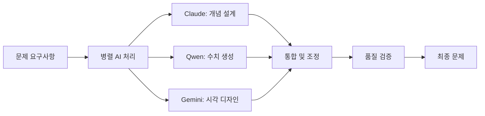

# 🚀 향상된 문제 제작 프레임워크 v3.0

## 🎯 핵심 혁신 사항

### 1. 다차원 난이도 시스템
- 연속적 난이도 점수 (0.0-5.0)
- 3차원 복잡도 분석 (인지적/수학적/맥락적)
- 실시간 난이도 캘리브레이션

### 2. ZPD 기반 적응형 학습
- 개인별 근접발달영역 실시간 측정
- 동적 스캐폴딩 강도 조절
- 최적 도전 수준 자동 설정

### 3. AI 협업 문제 생성
- Claude (추론) + Qwen (계산) + Gemini (시각화)
- 가중 합의 알고리즘
- 병렬 처리 최적화

## 📊 확장된 난이도 매트릭스

### 연속 난이도 점수 시스템

```javascript
const difficultyMatrix = {
  // Level 1: Foundation (0.0-1.0)
  '0.0-0.2': {
    name: 'Pre-Foundation',
    characteristics: '숫자 인식, 기본 개념 소개',
    workingMemory: 1,
    scaffolding: 'complete',
    visualSupport: 'concrete_manipulatives'
  },
  '0.2-0.5': {
    name: 'Early Foundation',
    characteristics: '단순 계산, 용어 이해',
    workingMemory: 2,
    scaffolding: 'extensive',
    visualSupport: 'pictorial_representations'
  },
  '0.5-1.0': {
    name: 'Foundation',
    characteristics: '기본 공식 적용',
    workingMemory: 3,
    scaffolding: 'guided',
    visualSupport: 'diagrams'
  },
  
  // Level 2: Application (1.0-2.0)
  '1.0-1.5': {
    name: 'Basic Application',
    characteristics: '단일 단계 문제',
    workingMemory: 3,
    scaffolding: 'moderate',
    visualSupport: 'simplified_diagrams'
  },
  '1.5-2.0': {
    name: 'Standard Application',
    characteristics: '2단계 문제 해결',
    workingMemory: 4,
    scaffolding: 'targeted',
    visualSupport: 'abstract_diagrams'
  },
  
  // Level 3: Strategic (2.0-3.0)
  '2.0-2.5': {
    name: 'Early Strategic',
    characteristics: '다단계 추론',
    workingMemory: 4,
    scaffolding: 'strategic_hints',
    visualSupport: 'conceptual_models'
  },
  '2.5-3.0': {
    name: 'Strategic Thinking',
    characteristics: '패턴 인식 및 일반화',
    workingMemory: 5,
    scaffolding: 'metacognitive',
    visualSupport: 'student_generated'
  },
  
  // Level 4: Extended (3.0-4.0)
  '3.0-3.5': {
    name: 'Complex Problem Solving',
    characteristics: '복합 개념 통합',
    workingMemory: 5,
    scaffolding: 'minimal',
    visualSupport: 'optional'
  },
  '3.5-4.0': {
    name: 'Advanced Application',
    characteristics: '실세계 모델링',
    workingMemory: 6,
    scaffolding: 'on_demand',
    visualSupport: 'professional_tools'
  },
  
  // Level 5: Creative (4.0-5.0)
  '4.0-4.5': {
    name: 'Innovation',
    characteristics: '새로운 방법 개발',
    workingMemory: 6,
    scaffolding: 'peer_collaboration',
    visualSupport: 'research_level'
  },
  '4.5-5.0': {
    name: 'Mastery',
    characteristics: '독창적 문제 생성',
    workingMemory: 7,
    scaffolding: 'self_directed',
    visualSupport: 'publication_quality'
  }
};
```

## 🧠 ZPD 적응형 엔진

### 실시간 ZPD 측정 시스템

```typescript
interface ZPDAdaptiveEngine {
  assessment: {
    independent_performance: number;  // 독립 수행 능력
    assisted_performance: number;     // 지원 시 수행 능력
    zpd_width: number;                // ZPD 범위
    optimal_challenge: number;        // 최적 도전 수준
  };
  
  scaffolding_calibration: {
    intensive: {
      threshold: 'zpd_width > 0.4',
      steps: 7,
      support_level: 'complete_guidance',
      fade_rate: 'very_slow'
    },
    moderate: {
      threshold: 'zpd_width > 0.25',
      steps: 5,
      support_level: 'partial_guidance',
      fade_rate: 'gradual'
    },
    light: {
      threshold: 'zpd_width > 0.1',
      steps: 3,
      support_level: 'hints_only',
      fade_rate: 'rapid'
    },
    minimal: {
      threshold: 'zpd_width <= 0.1',
      steps: 0,
      support_level: 'self_directed',
      fade_rate: 'immediate'
    }
  };
  
  dynamic_adjustment: {
    within_problem: 'real_time_hint_calibration',
    between_problems: 'difficulty_fine_tuning',
    across_sessions: 'learner_model_update'
  };
}
```

### 적응형 스캐폴딩 템플릿

```yaml
scaffoldingTemplates:
  intensive_7_steps:
    step1_activation:
      prompt: "이전에 배운 [개념]을 기억하나요?"
      support: 
        - visual_reminder
        - worked_example
        - vocabulary_review
    
    step2_extraction:
      prompt: "문제에서 중요한 정보를 찾아봅시다"
      support:
        - highlighting_tool
        - information_organizer
        - checklist
    
    step3_strategy:
      prompt: "어떤 방법을 사용할까요?"
      support:
        - strategy_menu
        - pros_cons_table
        - similar_problem_reference
    
    step4_planning:
      prompt: "단계별로 계획을 세워봅시다"
      support:
        - step_by_step_template
        - flowchart_builder
        - time_estimation
    
    step5_execution:
      prompt: "계획대로 실행해봅시다"
      support:
        - calculator_tool
        - progress_tracker
        - error_detection
    
    step6_verification:
      prompt: "답이 맞는지 확인해봅시다"
      support:
        - checking_strategies
        - reasonableness_test
        - alternative_methods
    
    step7_generalization:
      prompt: "비슷한 문제에도 적용할 수 있을까요?"
      support:
        - pattern_recognition
        - transfer_examples
        - concept_map
```

## 🤖 AI 협업 문제 생성 프로토콜

### 모델별 역할 분담

```javascript
const aiCollaborationProtocol = {
  claude: {
    role: 'conceptual_architect',
    tasks: [
      'problem_context_design',
      'logical_flow_validation',
      'explanation_generation',
      'misconception_anticipation'
    ],
    weight: 0.4
  },
  
  qwen: {
    role: 'computational_specialist',
    tasks: [
      'numerical_variation_generation',
      'calculation_verification',
      'difficulty_calibration',
      'solution_path_optimization'
    ],
    weight: 0.35
  },
  
  gemini: {
    role: 'visual_designer',
    tasks: [
      'diagram_creation',
      'visual_aid_generation',
      'interactive_element_design',
      'multimodal_representation'
    ],
    weight: 0.25
  },
  
  synthesis: {
    method: 'weighted_consensus',
    conflict_resolution: 'expertise_based_priority',
    quality_threshold: 0.85,
    iteration_limit: 3
  }
};
```

### 병렬 처리 워크플로우



## 📈 실시간 성과 분석 시스템

### 다차원 성과 벡터

```typescript
class PerformanceAnalyzer {
  calculatePerformanceVector(student: StudentData): PerformanceVector {
    return {
      // 정확도 차원
      accuracy: {
        raw: student.correctAnswers / student.totalAttempts,
        weighted: this.weightByDifficulty(student.attempts),
        trend: this.calculateTrend(student.recentAccuracy)
      },
      
      // 속도 차원
      speed: {
        absolute: student.averageTime,
        normalized: student.timeVsPeerMedian,
        efficiency: student.accuracyPerMinute
      },
      
      // 참여도 차원
      engagement: {
        interaction: student.clicksPerProblem,
        persistence: student.attemptsBeforeGiveUp,
        exploration: student.alternativeMethodsTried
      },
      
      // 자신감 차원
      confidence: {
        selfReported: student.confidenceRating,
        behavioral: this.inferConfidence(student.behavior),
        calibration: student.accuracyVsConfidence
      },
      
      // 도움 요청 차원
      helpSeeking: {
        frequency: student.hintRequestRate,
        timing: student.averageTimeBeforeHint,
        appropriateness: student.hintEffectiveness
      }
    };
  }
  
  recommendIntervention(vector: PerformanceVector): Intervention {
    if (vector.accuracy.raw < 0.6 && vector.engagement.persistence < 0.5) {
      return {
        type: 'immediate',
        action: 'reduce_difficulty',
        support: 'increase_scaffolding',
        encouragement: 'motivational_message'
      };
    }
    
    if (vector.accuracy.raw > 0.9 && vector.speed.efficiency > 0.8) {
      return {
        type: 'challenge',
        action: 'increase_difficulty',
        support: 'reduce_scaffolding',
        enrichment: 'extension_problems'
      };
    }
    
    // ... 추가 조건별 개입 전략
  }
}
```

## 🎨 향상된 PDF 디자인 시스템

### 인지 부하 최적화 레이아웃

```css
/* 향상된 PDF 최적화 스타일 */
@page {
  size: A4;
  margin: 2cm;
  marks: crop cross;
  bleed: 3mm;
}

.adaptive-problem-layout {
  /* 난이도별 색상 그라데이션 */
  --difficulty-gradient: linear-gradient(
    90deg,
    var(--level-color) 0%,
    var(--level-color) calc(var(--difficulty-score) * 20%),
    transparent calc(var(--difficulty-score) * 20%)
  );
  
  /* 인지 부하 시각화 */
  --cognitive-load-indicator: repeating-linear-gradient(
    45deg,
    transparent,
    transparent 10px,
    rgba(0,0,0,0.05) 10px,
    rgba(0,0,0,0.05) calc(10px + var(--load-level) * 2px)
  );
}

/* 적응형 스캐폴딩 박스 */
.adaptive-scaffold {
  position: relative;
  padding: 12px;
  margin: 15px 0;
  border-left: 4px solid var(--scaffold-color);
  background: linear-gradient(
    90deg,
    rgba(var(--scaffold-rgb), 0.1) 0%,
    rgba(var(--scaffold-rgb), 0.05) 50%,
    transparent 100%
  );
  
  &::before {
    content: attr(data-scaffold-level);
    position: absolute;
    top: -8px;
    left: -4px;
    padding: 2px 8px;
    background: var(--scaffold-color);
    color: white;
    font-size: 10px;
    border-radius: 2px;
  }
}

/* ZPD 위치 표시기 */
.zpd-indicator {
  display: flex;
  align-items: center;
  margin: 10px 0;
  
  .zpd-bar {
    flex: 1;
    height: 8px;
    background: linear-gradient(
      90deg,
      #4CAF50 0%,
      #FFC107 50%,
      #F44336 100%
    );
    border-radius: 4px;
    position: relative;
    
    .current-position {
      position: absolute;
      top: -4px;
      left: calc(var(--zpd-position) * 100%);
      width: 16px;
      height: 16px;
      background: white;
      border: 2px solid #2196F3;
      border-radius: 50%;
      box-shadow: 0 2px 4px rgba(0,0,0,0.2);
    }
  }
}
```

## 🔄 통합 구현 예제

### 완전한 문제 생성 파이프라인

```javascript
class EnhancedProblemGenerator {
  async generateAdaptiveProblem(params) {
    // 1. 학생 프로필 분석
    const studentProfile = await this.analyzeStudent(params.studentId);
    const zpd = this.assessZPD(studentProfile);
    
    // 2. AI 협업 문제 생성
    const [conceptual, numerical, visual] = await Promise.all([
      this.claude.generateConcept(params.unit, zpd),
      this.qwen.generateNumbers(params.unit, zpd),
      this.gemini.generateVisuals(params.unit, zpd)
    ]);
    
    // 3. 통합 및 최적화
    const problem = this.synthesize({
      conceptual,
      numerical,
      visual,
      weights: this.aiWeights
    });
    
    // 4. 난이도 캘리브레이션
    const difficulty = this.calibrateDifficulty(problem, studentProfile);
    
    // 5. 스캐폴딩 생성
    const scaffolding = this.generateScaffolding(problem, zpd);
    
    // 6. 인지 부하 최적화
    const optimized = this.optimizeCognitiveLoad(problem, studentProfile);
    
    // 7. PDF 포맷팅
    const formatted = this.formatForPDF(optimized);
    
    return {
      problem: formatted,
      metadata: {
        id: generateId(),
        difficulty: difficulty,
        zpd: zpd,
        estimatedTime: this.estimateTime(difficulty),
        scaffoldingLevel: scaffolding.level,
        cognitiveLoad: optimized.load
      }
    };
  }
}

// 실제 사용 예시
const generator = new EnhancedProblemGenerator();

const problem = await generator.generateAdaptiveProblem({
  studentId: 'student123',
  unit: 'ratios-and-proportions',
  grade: 6,
  targetAccuracy: 0.85,
  sessionGoal: 'mastery'
});

console.log('생성된 문제:', problem);
```

## 📊 품질 측정 메트릭

### 교육 효과성 지표

```yaml
qualityMetrics:
  educational_effectiveness:
    learning_gain:
      formula: (post_test - pre_test) / (100 - pre_test)
      target: "> 0.3"
    
    retention_rate:
      measurement: "1주 후 재평가"
      target: "> 80%"
    
    transfer_ability:
      measurement: "유사 문제 해결률"
      target: "> 75%"
  
  engagement_metrics:
    completion_rate:
      target: "> 90%"
    
    voluntary_practice:
      measurement: "추가 문제 요청률"
      target: "> 30%"
    
    satisfaction_score:
      measurement: "학생 피드백"
      target: "> 4.0/5.0"
  
  cognitive_efficiency:
    time_to_mastery:
      benchmark: "기존 대비 30% 단축"
    
    error_reduction:
      measurement: "반복 오류 감소율"
      target: "> 50%"
    
    hint_effectiveness:
      measurement: "힌트 후 정답률"
      target: "> 70%"
```

## 🚀 미래 확장 로드맵

### 단기 (1-3개월)
- [ ] 실시간 ZPD 추적 시스템 구현
- [ ] AI 모델 통합 API 개발
- [ ] 교사 대시보드 v1.0 출시
- [ ] A/B 테스트 프레임워크 구축

### 중기 (3-6개월)
- [ ] 머신러닝 기반 난이도 예측
- [ ] 다언어 지원 (영어, 중국어)
- [ ] 협업 학습 기능 추가
- [ ] 모바일 앱 개발

### 장기 (6-12개월)
- [ ] 전과목 확장 (과학, 언어)
- [ ] AR/VR 학습 경험 통합
- [ ] 글로벌 학습 커뮤니티 구축
- [ ] AI 튜터 음성 대화 기능

## 📚 참고 문헌

### 핵심 연구
1. **Adaptive Learning Systems** (2024)
   - Market growth: $1.79B → $7.41B by 2032
   - Performance improvement: 37.2%
   - Learning outcomes: +18.6%

2. **Cognitive Load Theory in Digital Learning** (2024)
   - Working memory capacity: 3-7 items
   - Progressive disclosure effectiveness
   - Multimodal learning benefits

3. **AI in Education** (2024)
   - LLM scaffolding quality comparable to experts
   - Personalization impact on engagement
   - Real-time adaptation benefits

### 구현 가이드
- `/mnt/c/palantir/math/implementation-integration-guide.md`
- `/mnt/c/palantir/math/unified-problem-framework.md`
- `/mnt/c/palantir/math/khan-academy-curriculum.json`

---

*Version 3.0 | Enhanced Framework*
*지속적 개선과 혁신을 추구합니다*