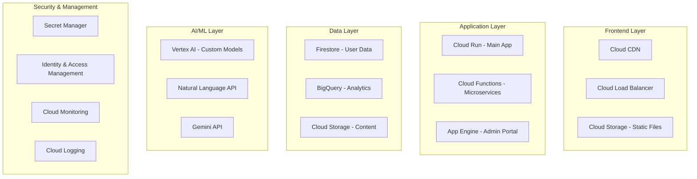

# 🚀 Math Education Platform - GCP Migration Architecture

## 현재 로컬 구조 → GCP 완전 마이그레이션

---

## 📊 현재 상태 분석

### 로컬 구조의 문제점
```yaml
문제점:
  - 확장성: 단일 서버 제한
  - 가용성: 로컬 장애 시 서비스 중단
  - 보안: API 키 로컬 저장
  - 협업: 팀 개발 어려움
  - 비용: 24/7 서버 운영 비효율
  - 백업: 수동 관리 필요
  - 모니터링: 제한적
```

---

## 🏗️ GCP Cloud Architecture



---

## 🔄 마이그레이션 전략

### Phase 1: Infrastructure Setup (Week 1)

#### 1.1 Project 초기화
```bash
# GCP 프로젝트 생성
gcloud projects create math-education-platform
gcloud config set project math-education-platform

# 필요한 API 활성화
gcloud services enable \
  run.googleapis.com \
  cloudfunctions.googleapis.com \
  firestore.googleapis.com \
  storage.googleapis.com \
  secretmanager.googleapis.com \
  aiplatform.googleapis.com \
  monitoring.googleapis.com \
  logging.googleapis.com \
  cloudcdn.googleapis.com
```

#### 1.2 Terraform 구성
```hcl
# terraform/main.tf
provider "google" {
  project = var.project_id
  region  = var.region
}

# VPC Network
resource "google_compute_network" "main" {
  name                    = "math-platform-network"
  auto_create_subnetworks = false
}

# Firestore Database
resource "google_firestore_database" "main" {
  project     = var.project_id
  name        = "(default)"
  location_id = var.region
  type        = "FIRESTORE_NATIVE"
}

# Cloud Storage Buckets
resource "google_storage_bucket" "static_content" {
  name          = "${var.project_id}-static"
  location      = var.region
  website {
    main_page_suffix = "index.html"
    not_found_page   = "404.html"
  }
  cors {
    origin          = ["*"]
    method          = ["GET", "HEAD"]
    response_header = ["*"]
    max_age_seconds = 3600
  }
}

resource "google_storage_bucket" "user_content" {
  name          = "${var.project_id}-user-content"
  location      = var.region
  versioning {
    enabled = true
  }
}

# Secret Manager
resource "google_secret_manager_secret" "api_keys" {
  secret_id = "api-keys"
  replication {
    automatic = true
  }
}
```

### Phase 2: Application Migration (Week 2)

#### 2.1 WebSocket Server → Cloud Run
```dockerfile
# Dockerfile
FROM node:18-alpine
WORKDIR /app
COPY package*.json ./
RUN npm ci --only=production
COPY . .
EXPOSE 8080
CMD ["node", "server.js"]
```

```yaml
# cloud-run-service.yaml
apiVersion: serving.knative.dev/v1
kind: Service
metadata:
  name: math-websocket-server
spec:
  template:
    metadata:
      annotations:
        run.googleapis.com/execution-environment: gen2
        run.googleapis.com/cpu-throttling: "false"
    spec:
      containerConcurrency: 1000
      containers:
      - image: gcr.io/math-education-platform/websocket-server
        ports:
        - containerPort: 8080
        resources:
          limits:
            cpu: "2"
            memory: "2Gi"
        env:
        - name: FIRESTORE_PROJECT
          value: math-education-platform
```

#### 2.2 API Services → Cloud Functions
```javascript
// functions/generateProblems/index.js
const { Firestore } = require('@google-cloud/firestore');
const { SecretManagerServiceClient } = require('@google-cloud/secret-manager');

const firestore = new Firestore();
const secretManager = new SecretManagerServiceClient();

exports.generateProblems = async (req, res) => {
  // CORS 처리
  res.set('Access-Control-Allow-Origin', '*');
  
  if (req.method === 'OPTIONS') {
    res.set('Access-Control-Allow-Methods', 'POST');
    res.set('Access-Control-Allow-Headers', 'Content-Type');
    res.status(204).send('');
    return;
  }

  const { grade, unit, topic, scaffoldingLevel, count } = req.body;
  
  try {
    // Gemini API 키 가져오기
    const [secret] = await secretManager.accessSecretVersion({
      name: 'projects/math-education-platform/secrets/gemini-api-key/versions/latest',
    });
    const apiKey = secret.payload.data.toString();
    
    // 문제 생성 로직
    const problems = await generateProblemsWithAI({
      grade,
      unit,
      topic,
      scaffoldingLevel,
      count,
      apiKey
    });
    
    // Firestore에 저장
    const batch = firestore.batch();
    problems.forEach(problem => {
      const docRef = firestore.collection('problems').doc();
      batch.set(docRef, {
        ...problem,
        createdAt: new Date(),
        grade,
        unit,
        topic
      });
    });
    await batch.commit();
    
    res.json({ success: true, problems });
  } catch (error) {
    console.error('Error generating problems:', error);
    res.status(500).json({ error: error.message });
  }
};
```

```yaml
# functions/generateProblems/function.yaml
name: generateProblems
runtime: nodejs18
entry_point: generateProblems
trigger:
  event_type: providers/cloud.firestore/eventTypes/document.create
  resource: projects/math-education-platform/databases/(default)/documents/problem_requests/{requestId}
environment_variables:
  NODE_ENV: production
max_instances: 100
min_instances: 1
memory: 512MB
timeout: 60s
```

### Phase 3: Data Migration (Week 3)

#### 3.1 Firestore 데이터 구조
```javascript
// Firestore Collections Structure
const collections = {
  users: {
    userId: {
      email: "student@example.com",
      grade: 8,
      createdAt: Timestamp,
      preferences: {
        language: "ko",
        difficulty: "medium"
      }
    }
  },
  
  progress: {
    progressId: {
      userId: "userId",
      unit: "algebra1_unit13",
      topics: {
        completed: ["topic1", "topic2"],
        current: "topic3",
        scores: {
          topic1: 0.85,
          topic2: 0.92
        }
      },
      lastUpdated: Timestamp
    }
  },
  
  problems: {
    problemId: {
      content: {
        question: "...",
        solution: "...",
        hints: ["hint1", "hint2"]
      },
      metadata: {
        grade: 8,
        unit: "algebra1_unit13",
        topic: "factoring",
        difficulty: 3,
        scaffoldingLevel: 2,
        tags: ["SAT", "quadratic"]
      },
      analytics: {
        attempts: 1234,
        successRate: 0.76,
        avgTime: 120
      }
    }
  },
  
  sessions: {
    sessionId: {
      userId: "userId",
      startTime: Timestamp,
      endTime: Timestamp,
      problems: ["problemId1", "problemId2"],
      performance: {
        correct: 8,
        total: 10,
        timeSpent: 1800
      }
    }
  }
};
```

#### 3.2 데이터 마이그레이션 스크립트
```javascript
// migration/migrate-to-firestore.js
const fs = require('fs').promises;
const { Firestore } = require('@google-cloud/firestore');
const firestore = new Firestore();

async function migrateData() {
  // 로컬 파일 읽기
  const files = await fs.readdir('./lola_math_data');
  
  const batch = firestore.batch();
  let batchCount = 0;
  
  for (const file of files) {
    const data = JSON.parse(await fs.readFile(`./lola_math_data/${file}`, 'utf8'));
    
    const docRef = firestore.collection('legacy_sessions').doc(file.replace('.json', ''));
    batch.set(docRef, {
      ...data,
      migratedAt: new Date(),
      source: 'local_filesystem'
    });
    
    batchCount++;
    
    // Firestore batch 제한 (500 operations)
    if (batchCount === 499) {
      await batch.commit();
      batch = firestore.batch();
      batchCount = 0;
    }
  }
  
  if (batchCount > 0) {
    await batch.commit();
  }
  
  console.log('Migration completed');
}
```

### Phase 4: Frontend Deployment (Week 3)

#### 4.1 Static Files → Cloud Storage + CDN
```bash
# HTML 파일들을 Cloud Storage로 업로드
gsutil -m cp -r *.html gs://math-education-platform-static/
gsutil -m cp -r css/ gs://math-education-platform-static/css/
gsutil -m cp -r js/ gs://math-education-platform-static/js/

# 공개 접근 설정
gsutil iam ch allUsers:objectViewer gs://math-education-platform-static

# Cloud CDN 설정
gcloud compute backend-buckets create math-platform-backend \
  --gcs-bucket-name=math-education-platform-static

gcloud compute url-maps create math-platform-lb \
  --default-backend-bucket=math-platform-backend

gcloud compute target-https-proxies create math-platform-proxy \
  --url-map=math-platform-lb \
  --ssl-certificates=math-platform-cert

gcloud compute forwarding-rules create math-platform-rule \
  --global \
  --target-https-proxy=math-platform-proxy \
  --ports=443
```

#### 4.2 Progressive Web App 구성
```javascript
// public/service-worker.js
const CACHE_NAME = 'math-platform-v1';
const urlsToCache = [
  '/',
  '/styles/main.css',
  '/scripts/main.js',
  '/offline.html'
];

self.addEventListener('install', event => {
  event.waitUntil(
    caches.open(CACHE_NAME)
      .then(cache => cache.addAll(urlsToCache))
  );
});

self.addEventListener('fetch', event => {
  event.respondWith(
    caches.match(event.request)
      .then(response => response || fetch(event.request))
      .catch(() => caches.match('/offline.html'))
  );
});
```

### Phase 5: AI/ML Integration (Week 4)

#### 5.1 Vertex AI Custom Model
```python
# vertex-ai/train_model.py
from google.cloud import aiplatform

aiplatform.init(
    project="math-education-platform",
    location="us-central1"
)

# Custom training job for problem generation
job = aiplatform.CustomTrainingJob(
    display_name="math-problem-generator",
    script_path="trainer/task.py",
    container_uri="gcr.io/cloud-aiplatform/training/tf-gpu.2-8:latest",
    requirements=["tensorflow>=2.8", "transformers>=4.20"],
    model_serving_container_image_uri="gcr.io/cloud-aiplatform/prediction/tf2-gpu.2-8:latest"
)

model = job.run(
    dataset=dataset,
    model_display_name="math-problem-generator-v1",
    machine_type="n1-standard-8",
    accelerator_type="NVIDIA_TESLA_T4",
    accelerator_count=1
)
```

#### 5.2 Gemini API Integration
```javascript
// services/gemini-service.js
const { GoogleGenerativeAI } = require("@google/generative-ai");
const { SecretManagerServiceClient } = require('@google-cloud/secret-manager');

class GeminiService {
  constructor() {
    this.secretManager = new SecretManagerServiceClient();
  }
  
  async initialize() {
    const [secret] = await this.secretManager.accessSecretVersion({
      name: 'projects/math-education-platform/secrets/gemini-api-key/versions/latest',
    });
    const apiKey = secret.payload.data.toString();
    this.genAI = new GoogleGenerativeAI(apiKey);
    this.model = this.genAI.getGenerativeModel({ model: "gemini-pro" });
  }
  
  async generateProblem(params) {
    const prompt = `
      Generate a ${params.difficulty} level math problem for:
      Grade: ${params.grade}
      Topic: ${params.topic}
      Scaffolding Level: ${params.scaffoldingLevel}
      Format: Include problem, step-by-step solution, and hints
      Language: ${params.language}
    `;
    
    const result = await this.model.generateContent(prompt);
    return result.response.text();
  }
  
  async analyzeSolution(problem, studentSolution) {
    const prompt = `
      Analyze this student solution:
      Problem: ${problem}
      Student's Answer: ${studentSolution}
      
      Provide:
      1. Correctness (true/false)
      2. Step-by-step feedback
      3. Common mistakes to avoid
      4. Hints for improvement
    `;
    
    const result = await this.model.generateContent(prompt);
    return JSON.parse(result.response.text());
  }
}
```

### Phase 6: Monitoring & Security (Week 4)

#### 6.1 Cloud Monitoring 설정
```yaml
# monitoring/alerts.yaml
apiVersion: monitoring.googleapis.com/v3
kind: AlertPolicy
metadata:
  name: high-error-rate
spec:
  displayName: "High Error Rate Alert"
  conditions:
  - displayName: "Error rate above 1%"
    conditionThreshold:
      filter: |
        resource.type="cloud_function"
        severity="ERROR"
      comparison: COMPARISON_GT
      thresholdValue: 0.01
      duration: 300s
  notificationChannels:
  - projects/math-education-platform/notificationChannels/email
```

#### 6.2 Security 구성
```javascript
// security/auth-middleware.js
const { OAuth2Client } = require('google-auth-library');
const client = new OAuth2Client(CLIENT_ID);

async function verifyToken(req, res, next) {
  const token = req.headers.authorization?.split('Bearer ')[1];
  
  if (!token) {
    return res.status(401).json({ error: 'No token provided' });
  }
  
  try {
    const ticket = await client.verifyIdToken({
      idToken: token,
      audience: CLIENT_ID
    });
    
    const payload = ticket.getPayload();
    req.user = {
      id: payload['sub'],
      email: payload['email'],
      name: payload['name']
    };
    
    // Firestore에서 사용자 권한 확인
    const userDoc = await firestore.collection('users').doc(req.user.id).get();
    if (!userDoc.exists) {
      // 신규 사용자 생성
      await firestore.collection('users').doc(req.user.id).set({
        ...req.user,
        createdAt: new Date(),
        role: 'student'
      });
    }
    
    next();
  } catch (error) {
    res.status(401).json({ error: 'Invalid token' });
  }
}
```

---

## 📊 비용 최적화

### 예상 월간 비용 (1000명 사용자 기준)
```yaml
Services:
  Cloud Run: $50 (2 인스턴스, 자동 스케일링)
  Cloud Functions: $20 (100K 호출/월)
  Firestore: $30 (10GB 저장, 1M 읽기/쓰기)
  Cloud Storage: $10 (100GB 정적 파일)
  Cloud CDN: $20 (1TB 전송)
  Vertex AI: $100 (맞춤 모델 호스팅)
  Monitoring: $10
  
Total: ~$240/월

비교:
  로컬 서버 24/7: ~$500/월 (전력, 인터넷, 하드웨어 감가상각)
  절감액: $260/월 (52% 절감)
```

### 비용 절감 전략
```javascript
// 1. Cloud Functions 콜드 스타트 최소화
const functions = require('@google-cloud/functions-framework');
functions.http('warmup', (req, res) => {
  res.status(200).send('OK');
});

// 2. Firestore 쿼리 최적화
// Bad
const allProblems = await firestore.collection('problems').get();
const filtered = allProblems.docs.filter(doc => doc.data().grade === 8);

// Good
const filtered = await firestore
  .collection('problems')
  .where('grade', '==', 8)
  .limit(10)
  .get();

// 3. CDN 캐싱 최대화
app.use((req, res, next) => {
  res.set('Cache-Control', 'public, max-age=86400'); // 24시간
  next();
});
```

---

## 🚀 마이그레이션 실행 계획

### Week 1: Infrastructure
- [ ] GCP 프로젝트 생성
- [ ] Terraform으로 인프라 프로비저닝
- [ ] CI/CD 파이프라인 구성 (Cloud Build)
- [ ] 개발/스테이징/프로덕션 환경 분리

### Week 2: Backend Migration
- [ ] Cloud Run으로 WebSocket 서버 배포
- [ ] Cloud Functions로 API 마이그레이션
- [ ] Secret Manager로 API 키 이전
- [ ] Pub/Sub로 이벤트 시스템 구축

### Week 3: Data & Frontend
- [ ] Firestore로 데이터 마이그레이션
- [ ] Cloud Storage에 정적 파일 업로드
- [ ] Cloud CDN 구성
- [ ] Load Balancer 설정

### Week 4: AI & Monitoring
- [ ] Vertex AI 모델 배포
- [ ] Gemini API 통합
- [ ] Cloud Monitoring 대시보드 구성
- [ ] 알림 정책 설정
- [ ] 보안 감사

### Week 5: Testing & Optimization
- [ ] 부하 테스트 (Cloud Load Testing)
- [ ] 성능 최적화
- [ ] 비용 분석 및 최적화
- [ ] 문서화 완료

---

## 🔄 롤백 계획

```bash
# 롤백 스크립트
#!/bin/bash
if [ "$1" == "rollback" ]; then
  echo "Rolling back to previous version..."
  gcloud run services update-traffic math-websocket-server \
    --to-revisions=PREVIOUS=100
  
  gsutil -m rsync -r gs://math-education-platform-static-backup/ \
    gs://math-education-platform-static/
  
  echo "Rollback completed"
fi
```

---

## 📈 성공 지표

### 기술적 지표
- 응답 시간: < 200ms (P95)
- 가용성: 99.9% SLA
- 에러율: < 0.1%
- 자동 스케일링: 1-100 인스턴스

### 비즈니스 지표
- 비용 절감: 50% 이상
- 사용자 만족도: 4.5/5 이상
- 개발 속도: 2배 향상
- 글로벌 확장 가능

---

## 🎯 최종 아키텍처 이점

1. **무한 확장성**: 자동 스케일링으로 사용자 증가 대응
2. **고가용성**: 멀티 리전 배포로 99.99% 가용성
3. **비용 효율성**: 사용한 만큼만 지불 (Pay-as-you-go)
4. **개발 생산성**: 서버리스로 인프라 관리 제거
5. **보안 강화**: Google의 엔터프라이즈급 보안
6. **AI 통합**: Vertex AI와 Gemini로 스마트한 교육
7. **실시간 분석**: BigQuery로 학습 패턴 분석
8. **글로벌 배포**: Cloud CDN으로 전 세계 서비스

---

*이 마이그레이션으로 로컬 제약을 벗어나 진정한 클라우드 네이티브 교육 플랫폼으로 전환됩니다.*