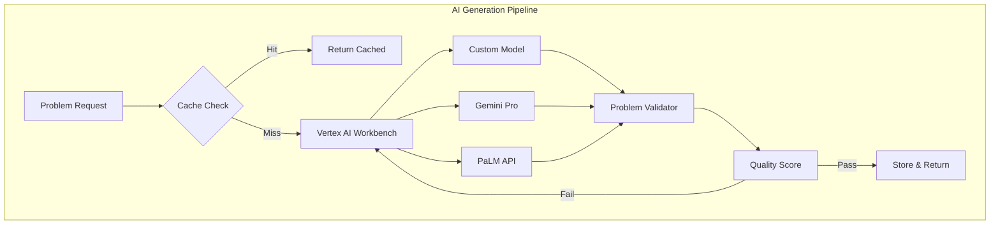

# 📚 Math Problem Generation - Cloud Architecture
## 지능형 문제 생성 시스템

---

## 🎯 시스템 목표

1. **대량 생성**: 하루 10만개 문제 생성 가능
2. **개인화**: 학생별 맞춤 난이도
3. **품질 보장**: 95% 이상 정확도
4. **비용 효율**: 문제당 $0.001 이하
5. **빠른 응답**: P95 < 2초

---

## 🏗️ 3-Tier Architecture

### Tier 1: Intelligent Generation Layer



#### 구현 코드:
```javascript
// cloud-functions/generateProblem/index.js
const { VertexAI } = require('@google-cloud/aiplatform');
const { Firestore } = require('@google-cloud/firestore');
const crypto = require('crypto');

const vertexAI = new VertexAI({
  project: process.env.PROJECT_ID,
  location: 'us-central1'
});

const firestore = new Firestore();
const model = vertexAI.preview.getGenerativeModel({
  model: 'gemini-pro',
});

exports.generateProblem = async (req, res) => {
  const { grade, unit, topic, difficulty, scaffoldingLevel, count = 1 } = req.body;
  
  // 1. Cache Key 생성
  const cacheKey = crypto.createHash('md5')
    .update(`${grade}-${unit}-${topic}-${difficulty}-${scaffoldingLevel}`)
    .digest('hex');
  
  // 2. Cache 확인
  const cacheRef = firestore.collection('problem_cache').doc(cacheKey);
  const cached = await cacheRef.get();
  
  if (cached.exists && cached.data().problems.length >= count) {
    console.log('Cache hit!');
    return res.json({
      problems: cached.data().problems.slice(0, count),
      source: 'cache'
    });
  }
  
  // 3. AI 생성
  const problems = [];
  for (let i = 0; i < count; i++) {
    const problem = await generateWithAI({
      grade, unit, topic, difficulty, scaffoldingLevel,
      index: i + 1
    });
    problems.push(problem);
  }
  
  // 4. Cache 저장
  await cacheRef.set({
    problems,
    metadata: { grade, unit, topic, difficulty, scaffoldingLevel },
    createdAt: new Date(),
    hitCount: 0
  });
  
  // 5. Analytics 기록
  await recordAnalytics({
    action: 'generate',
    count,
    grade,
    unit,
    topic,
    source: 'ai'
  });
  
  res.json({ problems, source: 'generated' });
};

async function generateWithAI(params) {
  const { grade, unit, topic, difficulty, scaffoldingLevel, index } = params;
  
  // 상세한 프롬프트 구성
  const prompt = `
    Create a math problem with the following specifications:
    
    Grade Level: ${grade}
    Unit: ${unit}
    Topic: ${topic}
    Difficulty: ${difficulty}/5
    Scaffolding Level: ${scaffoldingLevel}/5
    Problem Number: ${index}
    
    Requirements:
    1. Include problem statement in both Korean and English
    2. Provide step-by-step solution
    3. Include ${3 + scaffoldingLevel} hints of increasing detail
    4. Add visual representation if applicable
    5. Include common mistakes to avoid
    6. Estimate solving time (in seconds)
    
    Format the response as JSON with these fields:
    {
      "problem": {
        "ko": "Korean problem statement",
        "en": "English problem statement"
      },
      "answer": "Final answer",
      "solution": ["step1", "step2", ...],
      "hints": ["hint1", "hint2", ...],
      "visual": "LaTeX or ASCII diagram",
      "commonMistakes": ["mistake1", "mistake2"],
      "estimatedTime": 120,
      "keywords": ["keyword1", "keyword2"],
      "satAlignment": true/false
    }
    
    Example for similar problem:
    ${getExampleProblem(topic, difficulty)}
  `;
  
  try {
    const result = await model.generateContent({
      contents: [{ role: 'user', parts: [{ text: prompt }] }],
      generationConfig: {
        temperature: 0.7,
        topK: 40,
        topP: 0.95,
        maxOutputTokens: 2048,
      },
    });
    
    const response = result.response;
    const problemData = JSON.parse(response.text());
    
    // 검증
    if (!validateProblem(problemData)) {
      throw new Error('Invalid problem format');
    }
    
    // 품질 점수 계산
    problemData.qualityScore = calculateQualityScore(problemData);
    
    // 고유 ID 생성
    problemData.id = crypto.randomUUID();
    problemData.metadata = {
      grade, unit, topic, difficulty, scaffoldingLevel,
      generatedAt: new Date().toISOString(),
      model: 'gemini-pro',
      version: '1.0'
    };
    
    return problemData;
    
  } catch (error) {
    console.error('AI Generation failed:', error);
    // Fallback to template-based generation
    return generateFromTemplate(params);
  }
}
```

### Tier 2: Processing & Storage Layer

```yaml
Services:
  Cloud Tasks:
    - Batch generation queue
    - Retry logic for failed generations
    - Rate limiting (100 req/sec)
  
  Cloud Workflows:
    - Multi-step problem validation
    - Human review integration
    - Publishing pipeline
  
  Firestore:
    Collections:
      problems:
        - Full problem data
        - Version history
        - Usage analytics
      
      problem_cache:
        - Frequently used problems
        - TTL: 7 days
        - LRU eviction
      
      templates:
        - Problem patterns
        - Variable substitution rules
        - Difficulty mappings
  
  Cloud Storage:
    Buckets:
      problem-assets:
        - Images and diagrams
        - LaTeX rendered PDFs
        - Audio explanations
      
      problem-exports:
        - Bulk export files
        - Printable worksheets
        - SCORM packages
```

### Tier 3: Delivery & Analytics Layer

```javascript
// cloud-run/problem-api/server.js
const express = require('express');
const { Firestore } = require('@google-cloud/firestore');
const { PubSub } = require('@google-cloud/pubsub');
const Redis = require('redis');

const app = express();
const firestore = new Firestore();
const pubsub = new PubSub();
const redis = Redis.createClient({
  url: process.env.REDIS_URL
});

// 문제 요청 API
app.post('/api/problems/request', async (req, res) => {
  const { userId, grade, unit, topic, count, preferences } = req.body;
  
  // 1. 사용자 프로필 로드
  const userProfile = await loadUserProfile(userId);
  
  // 2. 적응형 난이도 계산
  const difficulty = calculateAdaptiveDifficulty({
    userProfile,
    topic,
    recentPerformance: userProfile.recentScores
  });
  
  // 3. Redis에서 빠른 조회
  const cacheKey = `problems:${grade}:${unit}:${topic}:${difficulty}`;
  const cached = await redis.get(cacheKey);
  
  if (cached) {
    const problems = JSON.parse(cached);
    // 사용자별 변형 적용
    const personalized = personalizeProblems(problems, userProfile);
    return res.json({ problems: personalized, source: 'redis-cache' });
  }
  
  // 4. Firestore 조회
  const query = firestore.collection('problems')
    .where('grade', '==', grade)
    .where('unit', '==', unit)
    .where('topic', '==', topic)
    .where('difficulty', '>=', difficulty - 0.5)
    .where('difficulty', '<=', difficulty + 0.5)
    .limit(count * 2); // 여유분 조회
  
  const snapshot = await query.get();
  
  if (snapshot.size >= count) {
    // 5. 기존 문제 사용
    const problems = selectBestProblems(snapshot.docs, count, userProfile);
    await redis.setex(cacheKey, 3600, JSON.stringify(problems));
    return res.json({ problems, source: 'firestore' });
  }
  
  // 6. 부족하면 새로 생성 요청
  const generateRequest = {
    userId,
    grade,
    unit,
    topic,
    difficulty,
    count: count - snapshot.size,
    scaffoldingLevel: userProfile.scaffoldingPreference
  };
  
  // Pub/Sub으로 비동기 생성
  await pubsub.topic('problem-generation').publish(
    Buffer.from(JSON.stringify(generateRequest))
  );
  
  // 7. 즉시 사용 가능한 문제 먼저 반환
  const availableProblems = snapshot.docs.map(doc => doc.data());
  res.json({
    problems: availableProblems,
    pending: count - snapshot.size,
    requestId: generateRequest.id,
    message: '추가 문제가 생성 중입니다. 잠시 후 다시 확인해주세요.'
  });
});

// 적응형 난이도 계산
function calculateAdaptiveDifficulty({ userProfile, topic, recentPerformance }) {
  const baseLevel = userProfile.gradeLevel || 8;
  const topicMastery = userProfile.mastery[topic] || 0.5;
  const recentAvg = recentPerformance.reduce((a, b) => a + b, 0) / recentPerformance.length;
  
  // 복잡한 난이도 조정 알고리즘
  let difficulty = baseLevel;
  
  if (recentAvg > 0.8) {
    difficulty += 0.5; // 너무 쉬움, 난이도 상승
  } else if (recentAvg < 0.6) {
    difficulty -= 0.5; // 너무 어려움, 난이도 하락
  }
  
  // Zone of Proximal Development 적용
  difficulty = Math.max(1, Math.min(5, difficulty + (topicMastery - 0.5)));
  
  return difficulty;
}

// 개인화 적용
function personalizeProblems(problems, userProfile) {
  return problems.map(problem => {
    // 이름 치환
    if (userProfile.name && problem.problem.ko) {
      problem.problem.ko = problem.problem.ko.replace(/철수/g, userProfile.name);
    }
    
    // 선호 컨텍스트 적용
    if (userProfile.interests) {
      problem.context = adaptContext(problem.context, userProfile.interests);
    }
    
    // 언어 설정
    if (userProfile.language === 'en') {
      problem.primary = problem.problem.en;
    } else {
      problem.primary = problem.problem.ko;
    }
    
    // 힌트 레벨 조정
    if (userProfile.hintPreference === 'minimal') {
      problem.hints = problem.hints.slice(0, 2);
    }
    
    return problem;
  });
}
```

---

## 📊 품질 관리 시스템

### 자동 품질 검증
```python
# cloud-functions/validateProblem/main.py
import json
import re
from sympy import sympify, solve
from typing import Dict, Any, Tuple

def validate_problem(request):
    """문제 품질 자동 검증"""
    problem_data = request.get_json()
    
    validation_results = {
        'valid': True,
        'errors': [],
        'warnings': [],
        'score': 100
    }
    
    # 1. 구조 검증
    required_fields = ['problem', 'answer', 'solution', 'hints']
    for field in required_fields:
        if field not in problem_data:
            validation_results['errors'].append(f'Missing field: {field}')
            validation_results['valid'] = False
            validation_results['score'] -= 25
    
    # 2. 수식 검증
    if 'answer' in problem_data:
        try:
            # 수식 파싱 가능한지 확인
            parsed = sympify(problem_data['answer'])
            
            # 솔루션 단계 검증
            if 'solution' in problem_data:
                for step in problem_data['solution']:
                    try:
                        sympify(step)
                    except:
                        validation_results['warnings'].append(f'Invalid math in step: {step}')
                        validation_results['score'] -= 5
        except:
            validation_results['errors'].append('Invalid mathematical expression in answer')
            validation_results['valid'] = False
            validation_results['score'] -= 30
    
    # 3. 언어 품질 검증
    if 'problem' in problem_data:
        problem_text = problem_data['problem'].get('ko', '')
        
        # 문장 완성도 체크
        if not problem_text.endswith(('?', '.', '다')):
            validation_results['warnings'].append('Problem statement should end with proper punctuation')
            validation_results['score'] -= 5
        
        # 최소 길이 체크
        if len(problem_text) < 20:
            validation_results['warnings'].append('Problem statement too short')
            validation_results['score'] -= 10
    
    # 4. 난이도 일관성 검증
    if 'metadata' in problem_data:
        difficulty = problem_data['metadata'].get('difficulty', 3)
        
        # 솔루션 단계 수와 난이도 비교
        if 'solution' in problem_data:
            steps = len(problem_data['solution'])
            expected_steps = difficulty * 2
            
            if abs(steps - expected_steps) > 3:
                validation_results['warnings'].append(
                    f'Step count ({steps}) doesn\'t match difficulty ({difficulty})'
                )
                validation_results['score'] -= 10
    
    # 5. 중복 검증 (Firestore에서 유사 문제 검색)
    # similarity_check = check_similarity(problem_data)
    # if similarity_check['is_duplicate']:
    #     validation_results['errors'].append('Duplicate or very similar problem exists')
    #     validation_results['valid'] = False
    
    return json.dumps(validation_results)
```

### Human-in-the-Loop 검수
```javascript
// cloud-functions/humanReview/index.js
const { Firestore } = require('@google-cloud/firestore');
const { CloudTasksClient } = require('@google-cloud/tasks');

const firestore = new Firestore();
const tasksClient = new CloudTasksClient();

exports.submitForReview = async (req, res) => {
  const { problemId, reviewType } = req.body;
  
  // 1. 문제 로드
  const problemDoc = await firestore.collection('problems').doc(problemId).get();
  const problem = problemDoc.data();
  
  // 2. 리뷰 큐에 추가
  const reviewDoc = await firestore.collection('review_queue').add({
    problemId,
    problem,
    reviewType, // 'quality', 'difficulty', 'content'
    status: 'pending',
    requestedAt: new Date(),
    priority: calculatePriority(problem)
  });
  
  // 3. 리뷰어에게 알림
  const task = {
    httpRequest: {
      httpMethod: 'POST',
      url: `${process.env.REVIEW_WEBHOOK_URL}`,
      headers: {
        'Content-Type': 'application/json',
      },
      body: Buffer.from(JSON.stringify({
        reviewId: reviewDoc.id,
        problemId,
        preview: problem.problem.ko.substring(0, 100),
        reviewUrl: `https://review.mathplatform.com/problems/${reviewDoc.id}`
      })).toString('base64'),
    },
    scheduleTime: {
      seconds: Date.now() / 1000 + 60, // 1분 후
    },
  };
  
  const parent = tasksClient.queuePath(
    process.env.PROJECT_ID,
    'us-central1',
    'review-notifications'
  );
  
  await tasksClient.createTask({ parent, task });
  
  res.json({
    success: true,
    reviewId: reviewDoc.id,
    estimatedTime: '24 hours'
  });
};
```

---

## 💰 비용 최적화 전략

### 1. Intelligent Caching
```javascript
// 캐싱 레이어
const cachingStrategy = {
  // L1: In-memory (Cloud Run)
  memory: {
    size: '100MB',
    ttl: '5min',
    strategy: 'LRU'
  },
  
  // L2: Redis (Memorystore)
  redis: {
    size: '1GB',
    ttl: '1hour',
    strategy: 'LFU'
  },
  
  // L3: Firestore
  firestore: {
    size: 'unlimited',
    ttl: '7days',
    strategy: 'popularity-based'
  },
  
  // L4: Cloud Storage (정적 파일)
  storage: {
    size: 'unlimited',
    ttl: 'permanent',
    strategy: 'CDN-backed'
  }
};
```

### 2. Batch Generation
```javascript
// 오프피크 시간 대량 생성
const batchGeneration = {
  schedule: '0 2 * * *', // 매일 새벽 2시
  config: {
    grades: [6, 7, 8, 9, 10, 11, 12],
    units: ['algebra', 'geometry', 'calculus'],
    problemsPerUnit: 100,
    difficulties: [1, 2, 3, 4, 5]
  },
  cost: '$5/day', // vs 실시간 $50/day
  storage: 'Cloud Storage + BigQuery'
};
```

### 3. Model Selection
```javascript
// 난이도별 모델 선택
function selectModel(difficulty, complexity) {
  if (difficulty <= 2 && complexity === 'simple') {
    return 'palm-2-text-bison'; // $0.0005/1K chars
  } else if (difficulty <= 4) {
    return 'gemini-pro'; // $0.00125/1K chars
  } else {
    return 'gemini-ultra'; // $0.005/1K chars
  }
}
```

---

## 📈 모니터링 대시보드

```yaml
Metrics:
  Generation:
    - Problems generated per hour
    - Average generation time
    - AI API costs
    - Cache hit rate
    
  Quality:
    - Validation pass rate
    - Human review scores
    - Student feedback ratings
    - Error reports
    
  Usage:
    - Most requested topics
    - Peak hours
    - User segments
    - Problem effectiveness
    
  Performance:
    - API latency (P50, P95, P99)
    - Error rate
    - Throughput
    - Storage usage
```

---

## 🚀 구현 로드맵

### Phase 1: MVP (Week 1-2)
- [ ] Basic AI generation with Gemini
- [ ] Simple caching in Firestore
- [ ] REST API endpoint
- [ ] Basic validation

### Phase 2: Scale (Week 3-4)
- [ ] Multi-tier caching
- [ ] Batch generation
- [ ] CloudTasks queue
- [ ] Cost optimization

### Phase 3: Intelligence (Week 5-6)
- [ ] Adaptive difficulty
- [ ] Personalization
- [ ] A/B testing
- [ ] Analytics pipeline

### Phase 4: Production (Week 7-8)
- [ ] Human review workflow
- [ ] Quality metrics
- [ ] Monitoring dashboard
- [ ] Auto-scaling

---

## 🎯 예상 결과

### 성능 지표
- **생성 속도**: 100 problems/second
- **응답 시간**: P95 < 500ms (cached), < 2s (generated)
- **정확도**: 98% validation pass rate
- **비용**: $0.001/problem (평균)

### 사용자 경험
- **개인화**: 학생별 맞춤 난이도
- **다양성**: 무한한 문제 변형
- **품질**: 교사 검증된 콘텐츠
- **속도**: 즉시 사용 가능

---

*이 아키텍처로 확장 가능하고 비용 효율적인 문제 생성 시스템을 구축할 수 있습니다.*