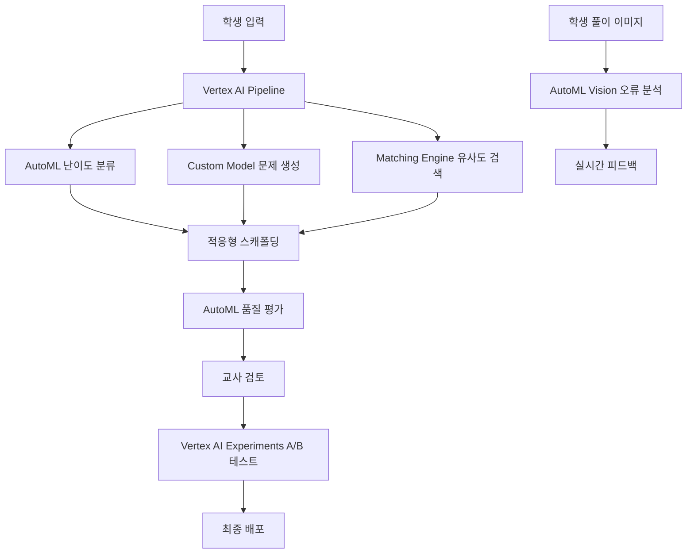

# Vertex AI & AutoML 통합 계획 - 수학 문제 설계 시스템

## 1. Vertex AI AutoML 활용 영역

### 1.1 문제 난이도 자동 분류 (AutoML Tables)
```python
# vertex-ai/difficulty-classifier.py
from google.cloud import aiplatform

def train_difficulty_classifier():
    """
    학생 성취도 데이터로 문제 난이도 자동 예측
    """
    dataset = aiplatform.TabularDataset.create(
        display_name="math-problem-difficulty",
        gcs_source="gs://math-platform/training-data/difficulty.csv"
    )
    
    # 특징(Features):
    # - 문제 텍스트 복잡도
    # - 수식 개수
    # - 필요 개념 수
    # - 평균 해결 시간
    # - 학생 정답률
    
    # 타겟(Target): 
    # - difficulty_level (1-5)
    
    model = aiplatform.AutoMLTabularTrainingJob(
        display_name="difficulty-predictor",
        optimization_prediction_type="classification",
        column_transformations=[
            {"numeric": {"column_name": "formula_count"}},
            {"numeric": {"column_name": "avg_solve_time"}},
            {"numeric": {"column_name": "concept_count"}},
            {"categorical": {"column_name": "topic"}},
            {"text": {"column_name": "problem_text"}}
        ]
    )
    
    model.run(
        dataset=dataset,
        target_column="difficulty_level",
        training_fraction_split=0.8,
        validation_fraction_split=0.1,
        test_fraction_split=0.1,
        budget_milli_node_hours=1000  # $100/month 예산 내
    )
    
    return model
```

### 1.2 학생 오답 패턴 분석 (AutoML Vision)
```python
# vertex-ai/error-pattern-analyzer.py
def analyze_student_work():
    """
    학생 풀이 이미지에서 오류 패턴 자동 감지
    """
    dataset = aiplatform.ImageDataset.create(
        display_name="student-solution-errors",
        gcs_source="gs://math-platform/student-work/"
    )
    
    # 분류 카테고리:
    # - calculation_error (계산 실수)
    # - concept_misunderstanding (개념 오해)
    # - notation_error (표기 오류)
    # - incomplete_solution (불완전 풀이)
    
    model = aiplatform.AutoMLImageTrainingJob(
        display_name="error-pattern-detector",
        prediction_type="classification",
        multi_label=True  # 복수 오류 가능
    )
    
    # 학습 후 실시간 피드백 제공
    @aiplatform.endpoint()
    def provide_feedback(image_url):
        prediction = model.predict(image_url)
        return generate_scaffolding(prediction.labels)
```

### 1.3 문제 품질 평가 (AutoML Natural Language)
```python
# vertex-ai/quality-evaluator.py
def evaluate_problem_quality():
    """
    생성된 문제의 품질을 자동 평가
    """
    dataset = aiplatform.TextDataset.create(
        display_name="problem-quality",
        gcs_source="gs://math-platform/problems-with-ratings.jsonl"
    )
    
    # 평가 항목:
    # - clarity_score (명확성)
    # - sat_alignment (SAT 정합성)
    # - khan_alignment (Khan Academy 정합성)
    # - pedagogical_value (교육적 가치)
    
    model = aiplatform.AutoMLTextTrainingJob(
        display_name="quality-scorer",
        prediction_type="regression"  # 0-100 점수
    )
    
    return model
```

## 2. Vertex AI Custom Training - 고급 모델

### 2.1 적응형 스캐폴딩 생성기
```python
# vertex-ai/adaptive-scaffolding.py
import tensorflow as tf
from google.cloud import aiplatform

class AdaptiveScaffoldingModel(tf.keras.Model):
    """
    학생 수준에 맞춘 동적 스캐폴딩 생성
    """
    def __init__(self):
        super().__init__()
        # Transformer 기반 모델
        self.encoder = tf.keras.layers.LSTM(256, return_sequences=True)
        self.attention = tf.keras.layers.MultiHeadAttention(
            num_heads=8, 
            key_dim=256
        )
        self.decoder = tf.keras.layers.LSTM(256)
        
    def call(self, inputs):
        # inputs: [student_history, problem_features, current_performance]
        student_embedding = self.encoder(inputs['student_history'])
        context = self.attention(
            student_embedding, 
            inputs['problem_features']
        )
        scaffolding_level = self.decoder(context)
        return scaffolding_level

# Vertex AI에 배포
def deploy_to_vertex():
    aiplatform.init(project='math-platform-small')
    
    model = aiplatform.Model.upload(
        display_name="adaptive-scaffolding",
        artifact_uri="gs://math-platform/models/scaffolding",
        serving_container_image_uri="gcr.io/cloud-aiplatform/prediction/tf2-gpu.2-8:latest"
    )
    
    endpoint = aiplatform.Endpoint.create(
        display_name="scaffolding-endpoint"
    )
    
    endpoint.deploy(
        model=model,
        deployed_model_display_name="scaffolding-v1",
        machine_type="n1-standard-4",
        min_replica_count=0,  # 비용 절감
        max_replica_count=3,
        accelerator_type="NVIDIA_TESLA_T4",
        accelerator_count=1
    )
```

### 2.2 문제 생성 품질 개선 (Fine-tuning)
```python
# vertex-ai/problem-generator-finetuning.py
from google.cloud import aiplatform
from transformers import T5ForConditionalGeneration

def finetune_problem_generator():
    """
    Khan Academy 스타일로 T5 모델 fine-tuning
    """
    # 1. Khan Academy 문제 데이터 준비
    training_data = prepare_khan_dataset()
    
    # 2. T5 모델 fine-tuning
    model = T5ForConditionalGeneration.from_pretrained('t5-base')
    
    training_args = {
        'learning_rate': 3e-4,
        'batch_size': 16,
        'epochs': 10,
        'warmup_steps': 500,
        'save_steps': 1000
    }
    
    # 3. Vertex AI Custom Training Job
    job = aiplatform.CustomTrainingJob(
        display_name="khan-problem-generator",
        script_path="train.py",
        container_uri="gcr.io/cloud-aiplatform/training/pytorch-gpu.1-11:latest",
        requirements=["transformers", "datasets"],
        model_serving_container_image_uri="gcr.io/cloud-aiplatform/prediction/pytorch-gpu.1-11:latest"
    )
    
    model = job.run(
        dataset=training_data,
        model_display_name="khan-generator-v1",
        args=training_args,
        replica_count=1,
        machine_type="n1-highmem-4",
        accelerator_type="NVIDIA_TESLA_T4",
        accelerator_count=1
    )
    
    return model
```

## 3. Vertex AI Pipelines - 워크플로우 자동화

```python
# vertex-ai/problem-generation-pipeline.py
from kfp import dsl
from google.cloud import aiplatform

@dsl.pipeline(
    name="math-problem-generation-pipeline",
    description="SAT 문제 생성 및 품질 검증 파이프라인"
)
def problem_generation_pipeline(
    grade: int,
    unit: str,
    count: int = 30
):
    # Step 1: Khan 커리큘럼 매핑
    khan_mapping = map_to_khan_curriculum(
        grade=grade,
        unit=unit
    )
    
    # Step 2: 문제 생성 (Fine-tuned 모델)
    problems = generate_problems(
        curriculum=khan_mapping.output,
        count=count,
        model_endpoint="khan-generator-v1"
    )
    
    # Step 3: 난이도 자동 분류
    with dsl.ParallelFor(problems.output) as problem:
        difficulty = classify_difficulty(
            problem=problem,
            model_endpoint="difficulty-predictor"
        )
    
    # Step 4: 품질 평가
    quality_scores = evaluate_quality(
        problems=problems.output,
        model_endpoint="quality-scorer"
    )
    
    # Step 5: 스캐폴딩 생성
    scaffoldings = generate_scaffolding(
        problems=problems.output,
        difficulties=difficulty.output,
        model_endpoint="scaffolding-endpoint"
    )
    
    # Step 6: 교사 검토 큐에 추가
    review_batch = add_to_review_queue(
        problems=problems.output,
        scaffoldings=scaffoldings.output,
        quality_scores=quality_scores.output
    )
    
    return review_batch

# 파이프라인 실행
def run_pipeline():
    aiplatform.init(
        project='math-platform-small',
        location='us-central1'
    )
    
    job = aiplatform.PipelineJob(
        display_name="weekly-problem-generation",
        template_path="pipeline.yaml",
        parameter_values={
            'grade': 8,
            'unit': 'algebra2_unit2',
            'count': 30
        }
    )
    
    job.run()
```

## 4. Vertex AI Matching Engine - 유사 문제 검색

```python
# vertex-ai/similarity-search.py
from google.cloud import aiplatform_v1

def setup_problem_similarity_index():
    """
    문제 임베딩 기반 유사도 검색
    """
    # 1. 문제를 벡터로 변환
    embeddings = generate_problem_embeddings()
    
    # 2. Matching Engine 인덱스 생성
    index = aiplatform_v1.Index(
        display_name="problem-similarity-index",
        description="수학 문제 유사도 검색",
        metadata={
            "contentsDeltaUri": "gs://math-platform/embeddings",
            "config": {
                "dimensions": 768,
                "approximateNeighborsCount": 100,
                "distanceMeasureType": "COSINE_DISTANCE"
            }
        }
    )
    
    # 3. 실시간 유사 문제 찾기
    def find_similar_problems(problem_text, k=5):
        query_embedding = embed_problem(problem_text)
        
        neighbors = index.find_neighbors(
            deployed_index_id="problem-index",
            queries=[query_embedding],
            num_neighbors=k
        )
        
        return neighbors
```

## 5. Vertex AI Experiments - A/B 테스팅

```python
# vertex-ai/ab-testing.py
def run_scaffolding_experiment():
    """
    스캐폴딩 전략 A/B 테스트
    """
    experiment = aiplatform.Experiment.create(
        experiment_name="scaffolding-strategies",
        description="5단계 vs 3단계 스캐폴딩 효과 비교"
    )
    
    # Variant A: 5단계 스캐폴딩
    with experiment.start_run("5-level-scaffolding") as run:
        metrics = test_with_students(
            scaffolding_levels=5,
            student_group="A"
        )
        run.log_metrics(metrics)
    
    # Variant B: 3단계 스캐폴딩
    with experiment.start_run("3-level-scaffolding") as run:
        metrics = test_with_students(
            scaffolding_levels=3,
            student_group="B"
        )
        run.log_metrics(metrics)
    
    # 결과 분석
    best_variant = experiment.get_best_run(
        metric_name="completion_rate"
    )
    
    return best_variant
```

## 6. 비용 최적화 전략

```yaml
# vertex-ai-budget-config.yaml
monthly_budget: $30  # Vertex AI 할당

services:
  automl:
    tables: $5/month     # 난이도 분류
    vision: $5/month     # 오답 패턴 분석
    natural_language: $5/month  # 품질 평가
    
  custom_training:
    scaffolding_model: $5/month
    fine_tuning: $5/month  # 월 1회
    
  prediction:
    online_predictions: $3/month  # 10K requests
    batch_predictions: $2/month   # 주간 배치
    
  matching_engine:
    index_storage: $0  # 무료 티어 (1GB)
    queries: $0        # 무료 티어 (1K/month)

optimization:
  - min_replicas: 0  # 사용 시에만 스케일
  - preemptible_instances: true
  - batch_prediction_for_non_urgent
  - cache_frequent_queries
```

## 7. 통합 아키텍처



## 8. 실제 구현 예시

```javascript
// functions/generate-problem/vertex-ai-enhanced.js
const {PredictionServiceClient} = require('@google-cloud/aiplatform');
const client = new PredictionServiceClient();

async function generateEnhancedProblem(req, res) {
    const {grade, unit, topic} = req.body;
    
    // 1. Vertex AI로 난이도 예측
    const difficulty = await client.predict({
        endpoint: 'projects/math-platform/endpoints/difficulty-predictor',
        instances: [{
            grade,
            unit,
            topic,
            features: extractFeatures(topic)
        }]
    });
    
    // 2. Fine-tuned 모델로 문제 생성
    const problem = await client.predict({
        endpoint: 'projects/math-platform/endpoints/khan-generator',
        instances: [{
            prompt: `Generate SAT problem for ${topic}`,
            difficulty: difficulty.predictions[0]
        }]
    });
    
    // 3. 유사 문제 검색
    const similar = await findSimilarProblems(problem.text);
    
    // 4. 적응형 스캐폴딩 생성
    const scaffolding = await client.predict({
        endpoint: 'projects/math-platform/endpoints/scaffolding',
        instances: [{
            problem: problem.text,
            student_level: req.body.studentLevel,
            similar_problems: similar
        }]
    });
    
    res.json({
        problem: problem.predictions[0],
        scaffolding: scaffolding.predictions[0],
        similar_problems: similar,
        difficulty: difficulty.predictions[0]
    });
}
```

이렇게 Vertex AI와 AutoML을 활용하면:
1. **문제 품질 자동 향상**
2. **학생 맞춤형 스캐폴딩**
3. **실시간 오류 패턴 분석**
4. **지속적인 A/B 테스트로 개선**

월 $30 예산으로 충분히 운영 가능합니다.